

# Moog 主办的演讲：AI 在航空业的应用科普

# 演讲目录

## 今天的分享议程 

- **第一章**：问候
- **第二章**：AI 的误解
- **第三章**：从基础聚类算法：直观理解 K-Means 开始
- **第四章**：万物皆可向量：把文字变成数字
- **第五章**：大模型的降维打击：从离散标签到连续向量空间
- **第六章**：万物皆可向量：从视觉解析到意图推断
- **第七章**：扫盲时间与算力引擎：AI的三大黑话与英伟达的护城河
- **第八章**：工程的奇迹：向量数据库与高维空间的“高速公路网”
- **第九章**：从聊天框到数字员工：人类驯服 AI 的工程进化史
- **第十章**：能力的边界：为何当前AI不适用于高度复杂的金融预测？
- **第十一章**：镜头拉远：2026 全球 AI 诸神之战与商业阳谋

::: notes
这是我们今天的分享议程。我们将从最基础的误解和模型原理出发，通过直观的比喻和生动的代码演示，带大家一步步拆解 AI 是如何从早期的语言模型演化成今天能够干活的数字员工的。同时，我们还会共同探讨大语言模型所具备的能力边界，以及在 2026 年这波时代浪潮下，科技巨头们的战略布局和我们航空业该采取的终极护城河策略。内容紧凑硬核，那么我们就直接开始。
:::

# 第一章：问候

## 欢迎：遇见 Anduin {data-background-image="Pics/Anduin_Profile.jpg" data-background-size="45vw" data-background-position="right"}

::: {.incremental}
- 🎓 东北大学毕业
- 💻 微软中国 5年研发积淀
- 🏢 深耕 数据中心基础设施
- ✈️ 山河航空私照飞行学员 (40小时飞行经验)
:::

::: notes
欢迎各位。

我是 Anduin ，我本科毕业于东北大学，我在微软中国研究了 5 年，主要研究方向是数据中心基础设施建设。我也是山河航空私照飞行学员 ，拥有 40 小时飞行经验。
:::

## AI 时代的新征程 {data-background-image="Pics/Flowise_AI_Agent_Workflow_Builder.webp" data-background-size="45vw" data-background-position="right"}

::: {.incremental}
- 🚀 AI 需求全面爆发
- 🌐 万物皆可 AI 化
- 🏢 创立 AIURSOFT LIMITED
- 🎯 专注 AI 技术研发
:::

::: notes
现在，各个公司对 AI 的兴趣越来越大，几乎我们方方面面都离不开 AI。我最近刚刚从微软离职，并且自己创业了一家公司 AIURSOFT LIMITED，专注于 AI 相关的技术和产品开发。
:::

## 颠覆与重塑：AI 的全面接管

:::::::::::::: {.columns}
::: {.column width="50%"}
::: {.incremental}
- 智能体与全面自动化
- 重塑客服与文案
- 淘汰传统翻译与初级开发人员
- 冲击设计、法务与影像
:::
:::
::: {.column width="50%"}
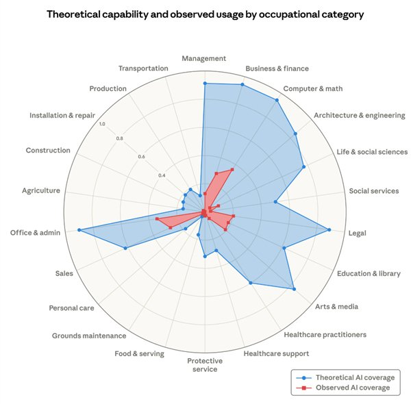
:::
::::::::::::::

::: notes
我们开始使用智能体，开始使用 AI 辅助办公，使用 AI 辅助管理我们的业务，库存，自动化大量流程。AI 正在重塑客服，取代了初级文案，淘汰了传统的翻译和初级开发人员，颠覆了平面设计，冲击了法务，马上也要革新视频剪辑了。AI 的发展速度之快，已经超出了我们所有人的想象。
:::

## 分秒必争的进化速度

:::::::::::::: {.columns}
::: {.column width="50%"}
::: {.incremental}
- 巨变仅在一年之间
- 从手工到 AI 驱动
- 人类下令，AI 执行
- 模型与应用日日更新
:::
:::
::: {.column width="50%"}
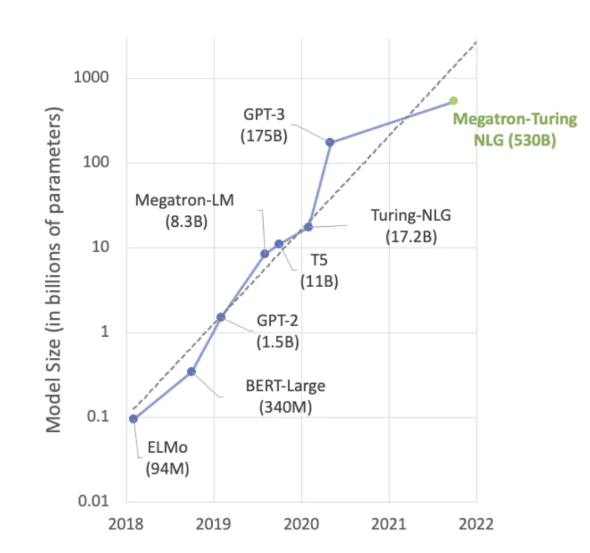
:::
::::::::::::::

::: notes
但令人震撼的是，这么多变化竟然都发生在一年内。在一年前我们还在庆祝Deepseek能够实现流畅的自然语言交互，今天我们的工作方式正在飞速的从过去传统手工的方式变成了 AI 驱动，人类下指令，AI 执行的方式。我们现在已经进入了一个 AI 时代了。

说是日新月异，都不够形容了，简直是分秒必争了。

每天都有新的公司发布新的 AI 产品，每天都有新的 AI 模型被训练出来，每天都有新的 AI 应用被开发出来。我们已经无法想象没有 AI 的世界了。
:::

## 破局：企业如何适应 AI 洪流？

:::::::::::::: {.columns}
::: {.column width="50%"}
::: {.incremental}
- 探寻 AI 的底层本质
- 解析机器的“人类错觉”
- 业务与流程的时代适配
- 探讨企业的关键抉择
:::
:::
::: {.column width="50%"}

:::
::::::::::::::

::: notes
今天很荣幸能在这里和大家分享一些关于 AI 的有趣内容。我们将一起探索 AI 的本质，了解它是如何工作的，以及它为什么会让我们感觉它“懂我们”。当然最重要的事情是，在这个飞速变化的背景下，我们究竟如何让我们的业务和流程能够更好的适应这个时代？我们是否要做改变、如何做出哪些转变？这都是我们要讨论的话题。
:::

# 第二章：AI 的误解

## AI 的误解

:::::::::::::: {.columns}
::: {.column width="50%"}
::: {.incremental}
- 误解：会思考的机器
- 误解：有意识的存在
- 亲戚的笑话：AI 帮理财
:::
:::
::: {.column width="50%"}
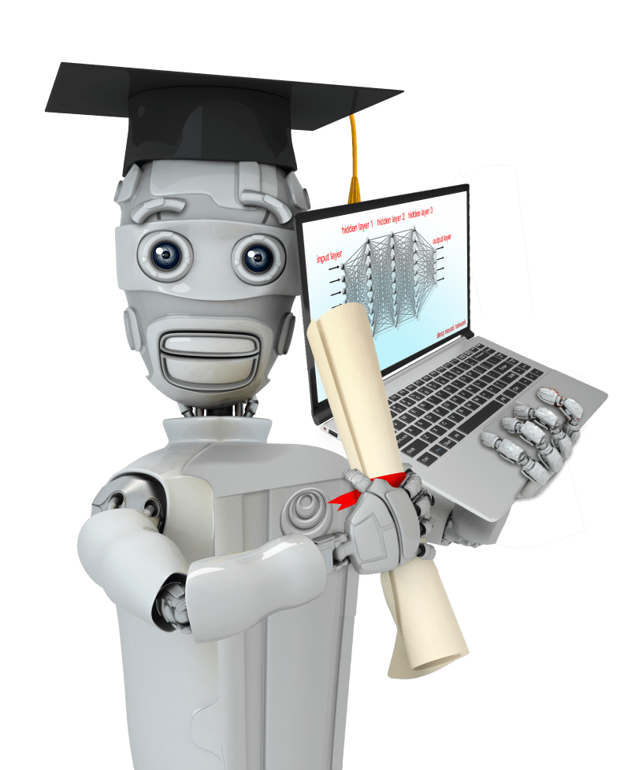
:::
::::::::::::::

::: notes
很多人觉得 AI 是一个神秘的概念，觉得它是一个会思考的机器，觉得它是一个有意识的存在。

我过年的时候，家里有一个亲戚，我告诉他，你可以像和人一样和 AI 对话，它能帮你解答一切问题。你知道亲戚第一件事做的是什么吗？他马上把自己的股票交易所账号密码告诉了 AI，说我没空盯盘，你完全帮去操作理财。哈哈，这听上去是个笑话，几乎我身边所有认识我的人，在AI浪潮来临时，问我的第一个问题都是：这玩意儿能帮我理财吗？
:::

## AI 的本质：大号输入法

:::::::::::::: {.columns}
::: {.column width="50%"}
::: {.incremental}
- 现实：文字生成模型
- 现实：关联文字输入法
- 学习语言规律
- 基于概率的输出
:::
:::
::: {.column width="50%"}
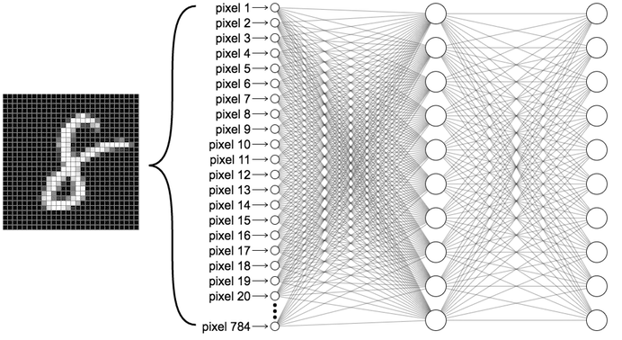
:::
::::::::::::::

::: notes
显然，今天的 AI 一定会拒绝他。但是这个故事也反映了很多人对 AI 的误解。很多人认为 AI 是一个意识，会自己干活。但我们其实都清楚它是一个文字生成模型，它是一个语言模型，它是根据大量的文本数据，学习到了语言的规律，然后根据输入的文本，生成符合规律的输出文本。换句话说，今天的大语言模型底层都是个大号的输入法，就像我输入珠穆朗玛，它会建议我输入峰一样。它是一个很强大的关联文字输入法。
:::

## AI Agent：数字员工的崛起

:::::::::::::: {.columns}
::: {.column width="50%"}
::: {.incremental}
- 具备意图推断能力
- 不再局限于聊天
- 实际干活的数字员工
- 复杂决策与自动化
:::
:::
::: {.column width="50%"}
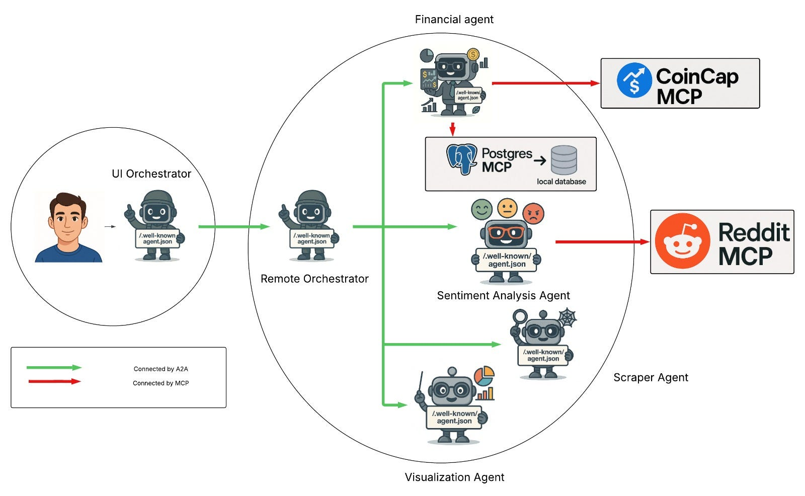
:::
::::::::::::::

::: notes
但我又要冷静下来，我们仔细思考一下，其实大部分场景下，AI 的确是很“懂我们”的。它能理解我们的语言，理解我们的意图，甚至理解我们的情感。它能根据我们的输入，给出很合理的回答，甚至是很有创意的回答。值得注意的是，市场上已经出现了海量的 AI Agent（智能体），这些 Agent 看起来已经不局限是单纯的聊天工具和语言模型了。它们变成了能**实际干活的数字员工**。它们能够操作手机上的 App，能够自主下单，执行终端命令，整理我们的办公邮件，甚至是进行极度复杂的决策，比如全自动开发软件、进行数据分析，甚至一键帮你把整个报告做成 PPT。仅凭文字描述可能不够直观，我们直接来看两个小演示。
:::

## Demo 1：一句话，让 AI 帮我干耗时的体力活

:::::::::::::: {.columns}
::: {.column width="50%"}
::: {.incremental}
- 一句话指令
- 自动分类整理
- 瞬间完成任务
- 代替耗时体力活
:::
:::
::: {.column width="50%"}
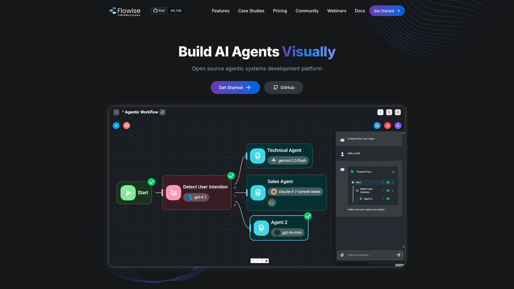
:::
::::::::::::::

::: notes
例如，我这里随便打开一个混乱不堪的文件夹（里面塞满了几百个图片、文档、视频，乱七八糟）。如果让人工去整理，怎么也要鼠标点个十分钟吧？
我直接启动我的 AI 工具（Gemini CLI），我在对话框里输入：“帮我把这个文件夹里的文件按照类型分门别类整理一下，图片放一起，文档放一起，视频放一起。”
（点击回车）请看，屏幕上的文件被迅速且精准地归类到了不同的文件夹里。Gemini CLI 轻轻松松地自己写了分类脚本并执行了。这叫“代替体力劳动”。
:::

## Demo 2：两分钟，让 AI 帮我干高智商的技术活

:::::::::::::: {.columns}
::: {.column width="50%"}
::: {.incremental}
- 两分钟写代码
- 零基础开发
- HTML5 物理引擎
- 无需外包排期
:::
:::
::: {.column width="50%"}
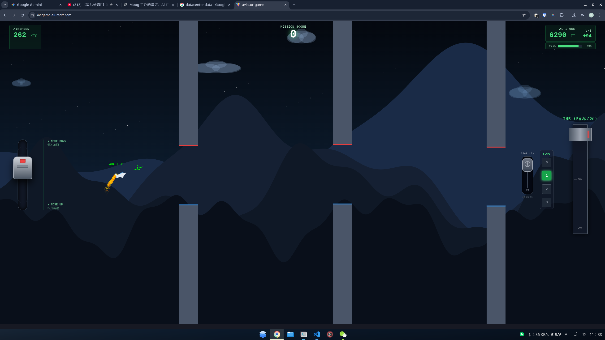
:::
::::::::::::::

::: notes
取代基础操作仅是开端，AI 在极其复杂的软件开发领域同样具有颠覆性？以前企业开发应用可能需要冗长的排期。现在则大大加快了进程。

请看，我现在新建一个完全空白的目录。我什么代码都不写。我直接打开 AI，输入这样一句话：
**“帮我写一个简单的飞行模拟小游戏。用 HTML5 和网页技术写，要有最基础的驾驶舱物理重力效果，按空格键可以拉起机头躲避障碍物。”**

（等待约 1-2 分钟，演示 AI 正在快速自动生成代码文件、创建结构、甚至自动启动本地服务器）

好了，请看，代码写完了。
我点击这个链接。可以看到，一个虽然简陋，但物理效果完全正确、能跑能飞的飞行小游戏，就这么活生生地在我们的浏览器里运行起来了。没有外包公司，没有排期，从无到有，仅仅花了不到 2 分钟！
:::

## 打破 AI 的黑盒

:::::::::::::: {.columns}
::: {.column width="50%"}
::: {.incremental}
- AI 是复杂的系统
- 航空业务的结合点？
- 什么是易？什么是难？
- 从痛点出发
:::
:::
::: {.column width="50%"}
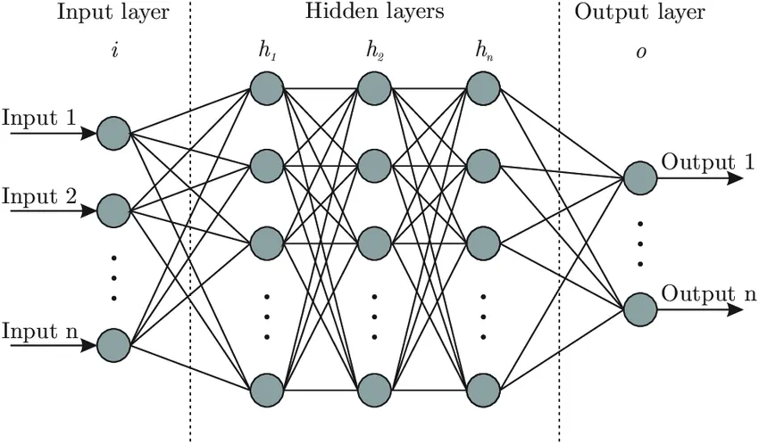
:::
::::::::::::::

::: notes
显然，当我们亲眼看到两分钟写完一个游戏之后，我们越来越感觉 AI 是个复杂的系统。我们虽然在日常中已经被这种震撼包围，但依然不知道这些千奇百怪的工具，究竟对于我们自己核心的航空业务是有用还是没用；我们的目标是什么？是彻底代替人，还是提升已有业务效率呢？它的底层究竟是怎么运转的？它凭什么能在两分钟里无中生有？

由于我并不身在航空公司的一线业务中，所以无法完全切身体会所有具体的业务痛点，正如许多企业管理者可能也不太深入探究什么是卷积神经网络，什么是 Transformer，什么是 Embedding，什么是向量空间，天天聊的豆包、小龙虾、OpenAI都是干嘛的？因此我们今天的这个会议，就是要努力打破这个黑盒。
:::

## 思考的准则

:::::::::::::: {.columns}
::: {.column width="50%"}
::: {.incremental}
- 建立判断标准
- 结合现有痛点
- 轻松上班
- 不被时代抛弃
:::
:::
::: {.column width="50%"}

:::
::::::::::::::

::: notes
我的目的不是介绍特定的一两种产品怎么用，而是传达给大家自己思考的准则：能够判断出什么事情是很容易做到，什么事情是很难做到的，什么事情是有用的，我们要学会在这个 AI 的时代里，如何和自己现有的痛点结合，最终实现让我们每天上班可以更加轻松，业务不被行业抛弃。

但是，在打破这些认知壁垒之前，我们还要先了解 AI 是如何工作的，最基础的背景。
:::

# 第三章：从基础聚类算法：直观理解 K-Means 开始

## 聚类算法的底层逻辑：K-Means

:::::::::::::: {.columns}
::: {.column width="50%"}
::: {.incremental}
- 航班旅客坐标系：X轴购票次数，Y轴平均价格
- 数据落点分布：直觉分类散客 vs 高端商务客
- 人类视觉天生擅长寻找“相似”和“聚集”
:::
:::
::: {.column width="50%"}
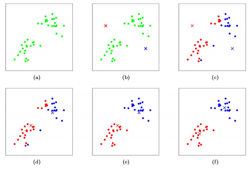
:::
::::::::::::::

::: notes
* **概要**：通过 X-Y 坐标系呈现两组数据聚落。人类的视觉系统天生擅长识别“相似性”与“聚集特征”。

想象一下，我们构建一个二维坐标系，X 轴代表旅客过去一年购买机票的“频次”，Y 轴代表其单次购票的“平均单价”。

现在，将我们航空公司的虚拟客户数据投射到该坐标系中，每个客户均表现为一个坐标点。

作为观察者，即便仅凭直觉审视该图，也能迅速识别出两个明显的聚落：左下角的大规模聚落（低频低价，推测为散客）与右上角的小规模聚落（高频高价，即高端商务常旅客）。这验证了一个基础规律：飞行频次与消费能力往往呈现正相关性。

这表明，人类的视觉直觉非常擅长捕捉数据间的“相似性”与“聚集度”，无需复杂计算即可完成初步分类。
:::

## 早期人工智能：K-Means 算法

:::::::::::::: {.columns}
::: {.column width="50%"}
> "计算机不靠看，它靠算。"

$$d = \sqrt{(x_2 - x_1)^2 + (y_2 - y_1)^2}$$

::: {.incremental}
- 计算机通过“算距离”理解相似性（欧氏距离）
- 随机设定中心点，循环算距离
- 不断迭代寻找最佳分类聚落直到稳定
:::
:::
::: {.column width="50%"}

:::
::::::::::::::

::: notes
然而，计算机并不具备视觉感知能力，它无法直接“看到”聚落。计算机实现分类的核心逻辑是基于数学运算。它通过计算点与点之间的几何距离来评估相似性。

在二维空间中，两点 $(x_1, y_1)$ 与 $(x_2, y_2)$ 之间的直线距离（欧氏距离）计算公式如下：

$$d = \sqrt{(x_2 - x_1)^2 + (y_2 - y_1)^2}$$

计算机的执行逻辑十分明确：它首先在空间中随机初始化两个聚合中心，随后对总体节点进行全局的距离计算以进行初步归属。谁离中心点 A 更近，谁就归属 A 类；谁离 B 近，就归属 B 类。分完之后，它再根据分好的群体重新找更准确的中心点，再算一遍距离。循环几次，直到一切稳定下来。

结果你会发现，计算机通过这种依赖严密测算的持续迭代机制，最终得出的机器分类结果与人类肉眼的直觉分类完全一致。

距离近的圈在一起，这就是计算机理解“相似性”的唯一方式。
:::

## 跨越维度的鸿沟

:::::::::::::: {.columns}
::: {.column width="50%"}
::: {.incremental}
- 从两维到三维：年龄
- 增加维度：餐食、航线、偏好...
- 千维空间：人类大脑无法想象
- 计算机：维度不是问题！
:::
:::
::: {.column width="50%"}
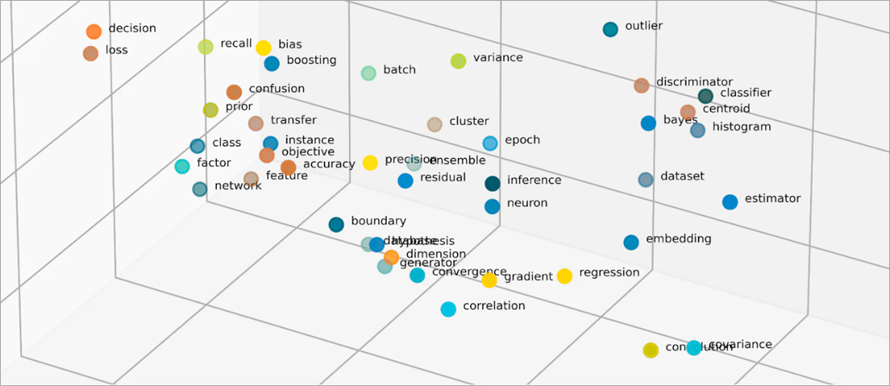
:::
::::::::::::::

::: notes
二维很好理解。现在，我们给这个坐标系加上一个 Z 轴，比如代表这个旅客的“年龄”。 $(x, y, z)$，这是一个三维立体空间，我们的点悬浮在了半空中。没关系，我们的大脑依然能想象出来，计算机也只需要在公式里再加一项即可。

接下来，我们需要进行一次逻辑上的推演。

如果我们再加一个维度，比如“偏好餐食（素食/肉食）”，再加一个“是否带小孩”，再加一个“常飞航线”，再加一千个、一万个描述这个旅客的特征……

到了四维、五维甚至一千维，我们人类的大脑就难以处理了，我们根本无法想象一个一千维的空间长什么样。**但是，对计算机而言，维度的增加并不会改变其数学运算的本质。**
:::

## 计算机眼中的“相似”

:::::::::::::: {.columns}
::: {.column width="50%"}
> 高维距离与低维数学本质毫无区别。

$$d = \sqrt{\sum_{i=1}^{n} (x_i - y_i)^2}$$

简化为向量的差的模（长度）：

$$d = \| \mathbf{x} - \mathbf{y} \|$$

::: {.incremental}
- 维度延伸：特征完美统一转化为向量
- 两向量差的模代表绝对的“相似度”
:::
:::
::: {.column width="50%"}
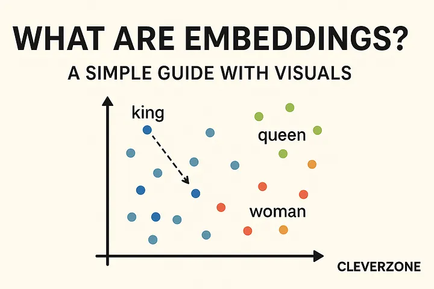
:::
::::::::::::::

::: notes
在计算机眼里，计算 2 个数字的距离，与计算 1000 个数字的距离，在数学本质上**完全相同**。它的距离公式仅是维度的延伸：

$$d = \sqrt{\sum_{i=1}^{n} (x_i - y_i)^2}$$

这个距离是两个点的欧氏距离。为了简化上面的公式，我们把它写成向量的形式：

$$d = \| \mathbf{x} - \mathbf{y} \|$$

可以看出，两个向量的距离，就是它们的差的模（长度）。这就是计算机理解“相似性”的方式。
:::

# 第四章：万物皆可向量
把文字变成数字

---

## 向量：人工智能的关键基石

:::::::::::::: {.columns}
::: {.column width="50%"}
::: {.incremental}
- 核心准则：**“距离”等同于“相关性”**
- 万物皆可映射为向量
- 归类、查询与逻辑推理的基础
- 计算机无需理解感性定义，只需数学运算
:::
:::
::: {.column width="50%"}

:::
::::::::::::::

::: notes
这个时候大家应该已经明白了，向量可以被计算机轻松聚类。如果我们把思维延伸到三维、四维、甚至一千维，在计算机底层的数学逻辑里，其实都是一样的。

既然如此，我们是不是可以得出一个结论：**一切可以被转换为向量的东西，都可以通过这种数学方式进行处理。** 我们将现实世界的事物映射为向量，进而让计算机进行归类、相似性查询及逻辑推理，这正是人工智能应用的关键基石。

在这个由向量构建的多维空间里，我们要确立一个核心准则：**“距离”等同于“相关性”。**

无论是用户的偏好、文档的内涵，还是图片的风格，只要我们在多维空间中计算出这两个“向量”的距离足够近，在逻辑上它们就是同类。距离越近，语义相关性越高。计算机无需理解感性的定义，它只需通过数学运算来评估相关性。
:::

---

## 4.1 给世界贴标签：博客文章的数字化实验

::: {.fragment}
- **第一篇**：A320 的起飞 $\Rightarrow$ [空客、起飞]
- **第二篇**：737 的降落 $\Rightarrow$ [波音、降落]
- **第三篇**：飞机的起降原理 $\Rightarrow$ [起飞、降落]
:::

::: notes
为了更为直观地展示此项转化过程，我们从基础的人工标签分类开始。假设在我们航空公司的内部知识库里，我刚刚写了三篇短小精悍的博客。

现在，我来给它们手工打上标签（Tag）：

* **第一篇博客：** 讲的是 “A320 的起飞”。我给它打的标签是：**空客、起飞**。
* **第二篇博客：** 讲的是 “737 的降落”。我给它打的标签是：**波音、降落**。
* **第三篇博客：** 讲的是 “飞机的起降原理”。我给它打的标签是：**起飞、降落**。
:::

---

## 4.1b 博客文章的向量化与距离计算

::: {.fragment}
| 博客文章 | 空客 | 起飞 | 降落 | 波音 | 特征向量 |
| :--- | :---: | :---: | :---: | :---: | :---: |
| **第一篇** | 1 | 1 | 0 | 0 | `[1, 1, 0, 0]` |
| **第二篇** | 0 | 0 | 1 | 1 | `[0, 0, 1, 1]` |
| **第三篇** | 0 | 1 | 1 | 0 | `[0, 1, 1, 0]` |
:::

::: {.fragment}
 

$$ d_{1,3} = \sqrt{(1-0)^2 + (1-1)^2 + (0-1)^2 + (0-0)^2} \approx 1.41 $$
:::

::: {.fragment}
 

$$ d_{1,2} = \sqrt{(1-0)^2 + (1-0)^2 + (0-1)^2 + (0-1)^2} = 2 $$
:::

::: notes
接下来，接下来我们看看实际效果。我们要把这三篇充满文字的博客，变成计算机能看懂的“向量”。

假设我们的系统目前很简陋，一共只有 4 个维度的标签，我们按照顺序排列它们：维度1是“空客”，维度2是“起飞”，维度3是“降落”，维度4是“波音”。如果博客包含了这个标签，我们就记为 1，没有就记为 0。

按照这个规则，我们的三篇博客瞬间就变成了空间里的三个向量：

| 博客文章 | 维度 1：空客 | 维度 2：起飞 | 维度 3：降落 | 维度 4：波音 | 最终生成的特征向量 |
| --- | --- | --- | --- | --- | --- |
| **第一篇 (A320 的起飞)** | 1 | 1 | 0 | 0 | `[1, 1, 0, 0]` |
| **第二篇 (737 的降落)** | 0 | 0 | 1 | 1 | `[0, 0, 1, 1]` |
| **第三篇 (飞机的起降原理)** | 0 | 1 | 1 | 0 | `[0, 1, 1, 0]` |

看，文字消失了，取而代之的是纯粹的数字。计算机通过算距离会发现，第三篇博客和第一篇、第二篇都有交集（距离比较近），而第一篇 and 第二篇可谓是完全不相关（距离最远）。

我们可以实际计算一下：第一篇（A320的起飞）和第二篇（737的降落）之间的直线距离（欧氏距离）是：

$$d = \sqrt{(1-0)^2 + (1-0)^2 + (0-1)^2 + (0-1)^2} = \sqrt{4} = 2$$

而第一篇（A320的起飞）和第三篇（飞机的起降原理）之间的欧氏距离是：

$$d = \sqrt{(1-0)^2 + (1-1)^2 + (0-1)^2 + (0-0)^2} = \sqrt{2} \approx 1.41$$

因为 1.41 小于 2，所以计算机得出结论：第一篇和第三篇更相似。这和我们人类的直觉完全一致。
:::

---

## 4.2 欧氏距离的致命漏洞：第四篇文章的乱入

::: {.fragment}
如果此时混入一篇完全无关联的第四篇文章：**“炒方便面的做法”** `[0, 0, 0, 0]`：
:::

::: {.fragment}
 

$$ d = \sqrt{(1-0)^2 + (1-0)^2 + (0-0)^2 + (0-0)^2} \approx 1.41 $$
:::

::: {.fragment}
 

::: {style="font-size: 1.2em; text-align: center; color: red;"}
**荒谬的推论：A320 起飞与起降原理的距离，竟然等于与炒方便面做法的距离！**
:::
:::

::: notes
看起来很完美，对吧？但是，假设此时，我们的知识库里混进了一篇完全无关联的第四篇文章：**“炒方便面的做法”**。

很显然，这篇文章既没有空客，也没有波音，既不起飞，也不降落。所以，按照我们的规则，它的特征向量全是 0：

* **第四篇 (炒方便面的做法)：** `[0, 0, 0, 0]` （如果它一定有标签，可能是：餐饮，就算是 [0, 0, 0, 0, 1]）

现在，我们让计算机算一下，第一篇（A320的起飞） and 这篇（炒方便面的做法）之间的欧氏距离：

$$d = \sqrt{(1-0)^2 + (1-0)^2 + (0-0)^2 + (0-0)^2} = \sqrt{2} \approx 1.41$$

这里存在一个明显的逻辑漏洞。

第一篇（A320起飞） and 第三篇（起降原理）的距离是 **1.41**。
第一篇（A320起飞） and 第四篇（炒方便面的做法）的距离竟然也是 **1.41**！

如果计算机泛化能力不足地依靠欧氏距离，它会十分愚蠢地告诉你：“A320的起飞” and “炒方便面的做法”的相关性，跟它 and “起降原理”的相关性是一模一样的！如果你是研发总监，明天你的系统给搜索飞机的飞行员推荐了炒方便面的做法，系统将变得不可用？

这显然是荒谬的。问题究竟出在哪里？

问题在于：**欧氏距离无法真正反映“相关性”。** 在欧氏距离的计算公式里，你因为“拥有一个不同的特征”所产生的距离，和你“缺失一个特征”所产生的距离，在数学上被等同对待了。这在处理高维稀疏特征时，是一场灾难。
:::

---

## 4.3 换个角度看世界：点乘与夹角余弦

:::::::::::::: {.columns}
::: {.column width="50%"}
::: {.fragment}
**向量点乘 (内积)**
 
**A320起飞** $\cdot$ **起降原理**
$1\times0 + 1\times1 + 0\times1 + 0\times0 = 1$
有交集！
  
**A320起飞** $\cdot$ **炒方便面**
$1\times0 + 1\times0 + 0\times0 + 0\times0 = 0$
毫不相干！
:::
:::

::: {.column width="50%"}
::: {.fragment}
**余弦相似度 (Cosine Similarity)**

$$ \cos(\theta) = \frac{\mathbf{x} \cdot \mathbf{y}}{\|\mathbf{x}\| \|\mathbf{y}\|} $$
 

* $\theta = 0^\circ \Rightarrow \cos(0^\circ) = 1$ (绝对契合)
* $\theta = 90^\circ \Rightarrow \cos(90^\circ) = 0$ (不相关)
:::
:::
::::::::::::::

::: notes
为了解决这个致命漏洞，我们需要借用高中数学里的另一个核心概念：**向量的点乘（内积）**。

什么是点乘？最直白的理解，点乘就是把两个向量在相同维度上的数字两两相乘，然后再全加起来。

我们用点乘来重新审视一下刚才的三篇文章：

* **A320起飞** `[1, 1, 0, 0]` 与 **起降原理** `[0, 1, 1, 0]` 的点乘：
$1\times0 + 1\times1 + 0\times1 + 0\times0 = 1$
（结果大于 0，说明它们在某个维度上有共鸣，产生了交集！）
* **A320起飞** `[1, 1, 0, 0]` 与 **炒方便面的做法** `[0, 0, 0, 0]` 的点乘：
$1\times0 + 1\times0 + 0\times0 + 0\times0 = 0$
（结果是 0，说明它们无论如何运算，都不会产生实质相关性，判定为毫不相干！）

看！仅仅换了一种简单的数学运算，炒方便面的做法就被系统完美地筛选排除。

在高中数学里，两个向量 $\mathbf{x}$ and $\mathbf{y}$ 的点乘，在几何上有一个优美的公式：

$$\mathbf{x} \cdot \mathbf{y} = \|\mathbf{x}\| \|\mathbf{y}\| \cos(\theta)$$

这里的 $\|\mathbf{x}\|$ and $\|\mathbf{y}\|$ 是两个向量的模（也就是长度），而 $\theta$ 是它们在多维空间中的夹角。

如果我们只想知道这两个向量的“方向”是不是一致的，我们其实只需要看那个夹角 $\theta$。把长度除过去，我们就得到了现代人工智能评估相似度最核心的公式——**余弦相似度 (Cosine Similarity)**：

$$\cos(\theta) = \frac{\mathbf{x} \cdot \mathbf{y}}{\|\mathbf{x}\| \|\mathbf{y}\|}$$

* 如果两篇文章方向完全一致，夹角 $\theta = 0^\circ$，$\cos(0^\circ) = 1$。这就是**绝对契合**。
* 如果两篇文章完全不相关（方向完全垂直），夹角 $\theta = 90^\circ$，$\cos(90^\circ) = 0$。

只要我们抛弃绝对的直线距离，转而去计算**夹角余弦**，“炒方便面的做法”的误判就永远不会发生了。
:::

---

## 4.4 终极技术：L2 归一化 (L2 Normalization)

::: {.fragment}
::: {style="font-size: 1.2em; text-align: center;"}
**强行把所有向量的长度变成 1（投射到“单位超球面”上）**
:::
:::

 

:::::::::::::: {.columns}
::: {.column width="50%"}
::: {.fragment}
**关于点乘**
$$ \mathbf{x} \cdot \mathbf{y} = 1 \times 1 \times \cos(\theta) = \cos(\theta) $$ 
单位超球面上：点乘直接等于余弦！
:::
:::

::: {.column width="50%"}
::: {.fragment}
**关于欧氏距离**
展开余弦定理：
$$ d^2 = 1^2 + 1^2 - 2\cos(\theta) $$
$$ d = \sqrt{2 - 2\cos(\theta)} $$
:::
:::
::::::::::::::

::: notes
讲到这里，有高中数学常识的各位可能会问出一个十分本质的问题：

**欧氏距离，夹角余弦，点乘。这三个东西，到底是什么关系？难道我们在写 AI 代码的时候，要根据不同的场景进行切换吗？**

这不符合计算机科学中“大道至简”的美学。于是，AI 工程师们引入了一个关键的数学概念——**L2 归一化 (L2 Normalization)**。

既然各个向量的“长度”不一会干扰我们的计算，那我们在把向量存入数据库之前，做一个标准化的预处理：**统一把所有向量的长度变成 1。**

在数学上，就是用向量里的每一个数字，除以它自己的模长。在几何上，这意味着把多维空间里所有长短不一的向量，全部拉伸或压缩，统一投射到一个**“单位超球面”**的表面上。

现在，接下来我们看看实际效果。

假设所有的向量都从原点出发，且它们的模长全都被强制变成了 1，即 $\|\mathbf{x}\| = 1$ and $\|\mathbf{y}\| = 1$。那么我们来看看最初的那三个概念会发生什么奇妙的化学反应：

**第一，关于点乘。**
根据刚才的公式：$\mathbf{x} \cdot \mathbf{y} = \|\mathbf{x}\| \|\mathbf{y}\| \cos(\theta)$
代入长度为 1：$\mathbf{x} \cdot \mathbf{y} = 1 \times 1 \times \cos(\theta) = \cos(\theta)$
结论：**在单位超球面上，两个向量的点乘，直接等于它们的夹角余弦！**

**第二，关于欧氏距离。**
我们来算一下这两个终点之间的直线距离的平方 $d^2 = \|\mathbf{x} - \mathbf{y}\|^2$。
大家还记得初中的完全平方公式吗？在向量世界里，它叫余弦定理展开：

$$\|\mathbf{x} - \mathbf{y}\|^2 = \|\mathbf{x}\|^2 + \|\mathbf{y}\|^2 - 2(\mathbf{x} \cdot \mathbf{y})$$

把长度为 1 代进去：

$$d^2 = 1^2 + 1^2 - 2\cos(\theta) = 2 - 2\cos(\theta)$$

得出最终的完美公式：

$$d = \sqrt{2 - 2\cos(\theta)}$$

**它把直线的距离（$d$） and 旋转的角度（$\cos(\theta)$），十分完美地绑定在了一起。**

当两篇文章越来越相似时，夹角越来越小，$\cos(\theta)$ 越来越接近 1。此时，公式里的 $2 - 2 \times 1 = 0$，欧氏距离 $d$ 也就无限趋近于 0。

殊途同归！在完成了 L2 归一化之后，无论你是算点乘、算余弦相似度、还是算欧氏距离，在数学本质上已经是**完全等价**的了！
:::

---

## 4.4b 归一化的奇妙应用

::: {.fragment}
展示单位超球面的三维可视化——各种长短不一的向量被 L2 归一化后，全部落在球面上。
:::

::: notes
那炒方便面的做法的事情解决了吗？让我们用新武器重新验证一下。

还记得那个让欧氏距离失效的例子吗？"A320的起飞" `[1, 1, 0, 0]` and "炒方便面的做法" `[0, 0, 0, 0]` 的欧氏距离是 1.41，跟"起降原理"一样。但现在，我们用点乘来审判它：

$$\mathbf{x} \cdot \mathbf{y} = 1 \times 0 + 1 \times 0 + 0 \times 0 + 0 \times 0 = 0$$

**点乘直接等于 0！** 两个特征向量在多维空间里完全垂直，夹角 $\theta = 90^\circ$，$\cos(90^\circ) = 0$。在我们这个极简 of 4 维手工模型里，它们没有任何维度上的交集，判定为**完全不相关**——干净利落。

在我们手工打造的 4 维标签空间里，点乘为 0 是完全精确的。但当我们用真正的大模型来处理同样这两篇文章时，你会发现炒方便面的做法 and A320 起飞的余弦相似度并不是绝对的 0。为什么？因为真实的大语言模型在处理文本时，会捕捉到标点符号、中文字符等通用语法结构，所以在 1024 维的空间里，几乎永远不会出现绝对的正交。
:::

---

## 重新审视：“日常菜谱”的被严谨隔离

::: {.fragment}
在我们这个极简的 4 维模型（并且强制长度为 1）里：

- **A320的起飞** 与 **日常菜谱**
:::

::: {.fragment}
**点乘**: $1 \times 0 + 1 \times 0 + 0 \times 0 + 0 \times 0 = 0$
:::

::: {.fragment}

点乘直接等于 0！ 
夹角 $\theta = 90^\circ$，$\cos(90^\circ) = 0$ 
它们没有任何交集，判定为完全不相关。

:::

::: notes
针对刚才日常菜谱的分类误判，我们现在以点乘运算进行检验：点乘直接等于 0！
这是因为两个特征向量在多维空间里完全垂直，夹角成了 90 度，毫无交集，被瞬间判断为完全不相关。干净利落。
但在真实的大模型中，由于捕捉标点和通用语法，极少出现绝对的正交，但距离依旧极其遥远，等会我们看看大模型怎么判断的。
:::

---

## 4.5 1024 维度的精细画像

::: {.fragment}
如果我们将标签数量增加到 **1024 个可能维度**？
每一次查询，系统不再是简单的关键字匹配，而是在这 1024 维的宇宙中，寻找距离最近的一组坐标。
:::

::: {.fragment}
 

### Demo 3：演示 AI 把文本变成向量 (bge-m3)
| 文档 A | 文档 B | 余弦相似度 (Cosine) | 欧氏距离 (L2) | 机器得出的结论 |
| :--- | :--- | :---: | :---: | :--- |
| 第一篇 (A320 的起飞) | 第二篇 (737 的降落) | **0.6108** | 0.8823 | 弱相关 (存在部分交集) |
| 第一篇 (A320 的起飞) | 第三篇 (飞机的起降原理) | **0.6541** | 0.8317 | 同领域 (有交集) |
| 第一篇 (A320 的起飞) | 第四篇 (日常菜谱制作) | **0.3252** | 1.1618 | 毫不相干 (完全不相关) | 
::: 

::: notes
刚才我们只手工贴了4个标签，但如果维度扩大呢？如果我们的系统可以容纳 1024 个维度的词库画像，搜索起落架故障时就不是找关键字，而是找距离最近的手册内容坐标。这就是早期搜索系统的核心原理。

我们会发现，虽然这很有效，但这种“人工打标签”的方式对人工标注的依赖程度过高，且容易受到人类主观意识的影响。若要进入真正的现代 AI 时代，我们必须解决一个核心问题：**能否实现维度的自主学习，从而让机器自动将文本转化为向量，而无需进行繁琐的人工标注？**

答案是肯定的，且机器在处理该任务时的精确度与效率远超人类。下面我们将通过演示直观展示这一过程。
:::

---

## 4.6 万物皆可向量化：只要有特征就是点

::: {.fragment}
**只要一个事物拥有特征，它就可以变成高维空间里的一个点。**
:::

:::::::::::::: {.columns}
::: {.column width="50%"}
::: {.incremental}
- **图片**：提取矩阵特征值即可
- **飞机实时飞行数据 (QAR)**：
  - 空速, 地速, 高度, 俯仰角，N1...
  - **由 500 多个核心传感器数据组成！**
  - 这就是 500 维空间里的**一个点**
:::
::: {.fragment}
 

飞机每秒的运动，就是 500 维宇宙里的连续轨迹！
:::
:::

::: {.column width="50%"}
::: {.fragment}

:::
:::
::::::::::::::

::: notes
讲了这么多，请各位不要被这四个字局限：不仅仅只有文字能向量化！在我们眼中，万物皆可向量化！
图片可以变成矩阵对应的高维向量；那么飞机的 QAR 数据呢？
一架波音 737 有多少个核心传感器？空速、俯仰、迎角……我们把这完整的 500 多个数据在这一秒的快照提取出来，它是什么样子的？在刚才我的那一套理论体系里：这架真实的飞机，它这一刻绝对状态的物理写照，这不就是一个完美的 500 维空间里的特征向量吗！这架飞机一连串按秒跳动的运动轨迹记录，就是在这个500维的坐标系中，一条条画出来的曲线。高维空间中复杂的运行状态，由此被精准呈现为可观测的定量的几何轨迹。
:::

---

## 让异常无处遁形：安全走廊

::: {.fragment}
在这个降维的宇宙里，我们不再需要几百条死板的 `IF-ELSE` 判断：
:::

::: {.incremental}
- **几十万个安全着陆航班的向量** $\Rightarrow$ 粗壮的“安全走廊”聚类
- **发生异常偏离的坐标** $\Rightarrow$ 欧氏距离急剧变大，直接触发报警
:::

::: {.fragment}
 

> "在底层算法看来，无论是处理旅客投诉、蒙皮划痕照片，还是两万英尺高空飞行的 A320，**均表现为高维空间的几何距离运算。**"
> **通过这套通用的数学逻辑，我们实现了业务数据处理的高度一致性。**
:::

::: notes
既然这种核心逻辑已被揭示，回顾一下，过去各部门抓“不稳定进近”，可能需要编写数百条互相干涉的判断条件和冗杂的代码逻辑，既耗时又难以保证准确率。
如何解决这个问题？方法十分直接：将航司十年来，在这条跑道上几十万个已经被验证为绝对安全的航班飞行向量，全投射到这片空间里。它们是非常相似的，在空间上就会聚集成一个连续的带状管子，这就是著名的安全走廊聚类。
只要新航班某个时刻的数据稍微有异常，它的点就会偏离走廊很远。你只需要计算一下这俩向量距离。只要几何距离一变大立刻报警。人工智能系统都不用懂什么是物理什么是迎角，我就看这点的欧式距离。
这就是我们今天要说明的底层机制：无论处理一段旅客投诉、一张蒙皮划痕照片，还是监控高空飞行的 A320，在底层算法看来，均表现为高维空间的几何距离运算。通过这套通用的数学逻辑，我们实现了业务数据处理的高度一致性。
:::

# 第五章：大模型的降维打击
从离散标签到连续向量空间

---

## 5.1 词嵌入矩阵 (Embedding Matrix)：超级词典

:::::::::::::: {.columns}
::: {.column width="50%"}
::: {.incremental}
- 突破：机器自主阅读海量文本
- 摆脱人类主观标签的束缚
- 每个词语分配为精确的1024维坐标
- 语义相近 $\Rightarrow$ 空间距离无限缩短
:::
:::
::: {.column width="50%"}

:::
::::::::::::::

::: notes
在上一章中，我们演示了如何通过人工提取“空客”、“降落”等 4 个离散标签，将文本转化为 `[1, 0, 1, 0]` 这样的二进制特征向量。但各位可以预见：一本波音 737 的 FCOM 飞行手册包含数千页内容，若完全依赖人工为每一页标注标签，其标注成本将极其高昂，且效率难以满足工业化需求。此外，人工标注具有较强的主观性——不同的技术人员可能使用“襟翼”、“增升装置”或“flap”等不同术语描述同一概念，这会导致系统检索精度大幅下降。

现代 AI 的核心突破，在于实现机器的自主阅读与语义识别。机器能够通过处理海量文本，自主发现词项间的深层关联，并构建出精确的 1024 维坐标体系，从而彻底摆脱对人工标注的依赖。这就是本章要探讨的底层逻辑：Embedding（词嵌入）与 Transformer 架构。

各位可以这样想象：**AI 在大规模预训练阶段，相当于在一个极度庞大的封闭语料库中，通过持续的自主学习来构建语言模型。** 它处理了包括网页、书籍、论文、新闻等在内的海量文本，其核心任务是通过分析每一个词项在不同上下文中的出现频次及其关联模式，形成一种高维特征表达。

这种“特征表达”，在数学上就叫做**词嵌入矩阵（Embedding Matrix）**。

你可以把它想象成一本**数字化的超级词典**。普通词典通过文字对“飞机”进行解释；但这本数字化词典则赋予了每个词语一个精确的 1024 维坐标——类似于为每个词语分配了一个多维空间的 GPS 定位。无论“飞机”、“航空器”还是“苹果”，在空间中均有其精确的坐标定位。
:::

---

## 词嵌入的深层数学表现

::: {.fragment}
 

**绝对正交的编号状态**：
$$ \mathbf{x}_{	ext{飞机}} \cdot \mathbf{x}_{	ext{苹果}} = 0 \quad 	ext{与} \quad \mathbf{x}_{	ext{飞机}} \cdot \mathbf{x}_{	ext{航空器}} = 0 $$
:::

::: {.fragment}
 

**精密坐标映射 (Embedding Matrix)**：
$$ \mathbf{e}_i = E \cdot \mathbf{x}_i \quad (E \in \mathbb{R}^{1024 	imes |V|}) $$
:::

::: {.fragment}
 

**多维空间里的高度重叠**：
$$ 	ext{cos}(	heta) = rac{\mathbf{e}_{	ext{飞机}} \cdot \mathbf{e}_{	ext{航空器}}}{\|\mathbf{e}_{	ext{飞机}}\| \|\mathbf{e}_{	ext{航空器}}\|} pprox 0.95 $$
:::

::: notes
在数学上，这个过程是这样的：AI 系统维护着一个庞大的词汇表（Vocabulary），假设包含 $|V| = 50000$ 个词。在最原始的状态下，每个词只是一个编号，彼此之间没有任何语义联系——"飞机"是第 3742 号，"航空器"是第 28156 号，它们的关系和"飞机"与"苹果"没有任何区别：

$\mathbf{x}_{\text{飞机}} \cdot \mathbf{x}_{\text{苹果}} = 0$
$\mathbf{x}_{\text{飞机}} \cdot \mathbf{x}_{\text{航空器}} = 0$

这就像一个航空公司的通讯录，只有工号，没有部门信息。你光看工号，根本不知道谁和谁是同事。

但经过大规模预训练之后，AI 自行学习出了一个致密的**权重矩阵（Embedding Matrix）**，记为 $E \in \mathbb{R}^{d \times |V|}$（$d = 1024$）。当"飞机"这个词被输入时，矩阵 $E$ 就像一台精密的坐标转换仪，瞬间把它从一个无意义的编号，投射成一个拥有 1024 个数字的稠密坐标：

$$\mathbf{e}_i = E \cdot \mathbf{x}_i$$

在这个由 AI 自主构建的 1024 维空间里，发生了显著的变化——**语义相近的词，坐标自动靠近：**

$$\text{cos}(\theta) = \frac{\mathbf{e}_{\text{飞机}} \cdot \mathbf{e}_{\text{航空器}}}{\|\mathbf{e}_{\text{飞机}}\| \|\mathbf{e}_{\text{航空器}}\|} \approx 0.95$$

"飞机"和"航空器"的余弦相似度高达 0.95——它们几乎重叠在一起！而"飞机"和"苹果"呢？可能只有 0.05，远在天涯。

**没有人告诉机器"飞机"和"航空器"是近义词。** 它完全是通过大规模阅读文本，发现这两个词总是出现在相似的上下文里（都和"航班"、"起飞"、"机场"做邻居），于是自动把它们的坐标安排到了一起。这就像你到了一个新公司，虽然没人告诉你组织架构，但你观察了一个月后发现，张三和李四总是一起开会、一起吃饭、一起加班——你自然就知道他们是同一个部门的。

机器用的就是这个极其朴素的逻辑，只不过它的观察对象是几十亿篇文章，它的"部门"有 1024 个维度。
:::

---

## 5.2 上下文突破：自注意力机制 (Self-Attention)

:::::::::::::: {.columns}
::: {.column width="50%"}
::: {.incremental}
- 静态词典的局限：每词一坐标，无法处理多义词
- 核心方案：词语的意思，由周遭的“邻居”决定
- **自注意力机制 (Self-Attention)**：捕捉环境动态跳跃
- 犹如百通道的大型调音台调整权重
:::
:::
::: {.column width="50%"}
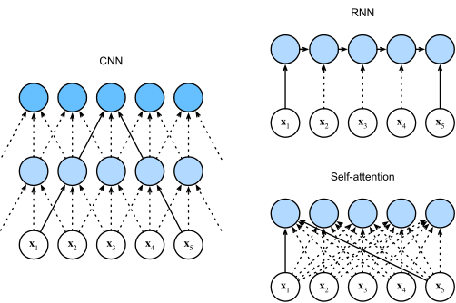
:::
::::::::::::::

::: notes
刚才我们讲的超级词典有一个巨大的问题：**每个词只有一个固定的坐标。**

但是各位想一想，中文里同一个字，在不同的句子里意思可能完全不同。比如"空"这个字：

* "**天空**很蓝" ——这里的"空"是 sky。
* "这个座位是**空**的" ——这里的"空"是 empty。
* "**SA60L 空飞机多重？**" ——这里的"空"是航空术语，指的是"空机重量"（Empty Weight），也就是飞机不载客、不加油时有多重。

如果"超级词典"里"空"只有一个固定坐标，那这个坐标就不得不是所有含义的"平均值"——既有点像天空，又有点像空闲，又有点像空重，结果哪个都不像。这就像你在人事系统里查到一个员工同时属于飞行部、客舱部和机务部，那他到底是干嘛的？

怎么解决？**看邻居。**

这就是 Transformer 架构的核心秘密：**自注意力机制（Self-Attention）**。

各位不需要看懂接下来屏幕上的公式。**大家只需要想象一个场景：一个拥有 1024 根推子（通道）的超级调音台。**

当"空"这个字进入 Transformer 时，它原本的声音是很杂乱的——1024 根推子处于一个模糊的默认位置，"天空"的频道开着，"空闲"的频道也开着，"空重"的频道也开着，嗡嗡嗡混成一团。

然后，Transformer 的技术启动了。"空"字向句子里的每一个邻居发出了一个电波：**"嘿，你们谁和我有关系？"**

"飞机"收到了电波，立刻回应了一个极强的信号——因为"空"和"飞机"在航空语境里经常一起出现。
"多重"也回应了一个很强的信号——因为"空"和"重量"在这种问句里是天然搭档。
而"SA60L"回应了一个中等信号。

于是，在深层矩阵计算下，调音台上的推子发生了剧烈的移动——代表"航空器"和"重量"的推子被猛烈推高，代表"蓝天"和"空闲"的推子被压到了底。一瞬间，"空"字在 1024 维空间里完成了一次精准的物理跳跃，从那个模糊的"平均位置"，稳稳落在了"无载客重量"的坐标上。

**这就是机器理解上下文的技术。同一个字，放进不同的句子，得到的坐标完全不同。**

如果你把"空"放进"天空很蓝"这个句子，"蓝"和"天"会把"空"字的推子拨向"sky"的方向。如果放进"这个座位是空的"，"座位"会把推子拨向"empty"的方向。每一次，都是周围的邻居在投票，决定这个字此时此刻的真正含义。
:::

---

## 自注意力机制的核心数学原理

::: {.fragment}
**提问者（Query）、被查询者（Key）、信息载体（Value）：**
$$ Q = XW^Q, \quad K = XW^K, \quad V = XW^V $$
:::

::: {.fragment}
 

**核心注意力分配矩阵：**
$$ 	ext{Attention}(Q, K, V) = 	ext{softmax}\left(rac{QK^T}{\sqrt{d_k}}
ight)V $$
:::

::: {.fragment}
 

**按概率吸收邻居特征：**
$$ \mathbf{z}_{	ext{空}} pprox 0.6 \cdot \mathbf{v}_{	ext{飞机}} + 0.3 \cdot \mathbf{v}_{	ext{多重}} + 0.1 \cdot \mathbf{v}_{	ext{其他}} $$
:::

::: notes
以下简要展示底层的数学公式（非技术背景听众可略过此段）：

设当前输入的句子构成了矩阵 $X \in \mathbb{R}^{L \times d}$（$L$ 为序列长度，$d = 1024$）。Transformer 把每个词同时投影成三个角色——**提问者（Query）、被查询者（Key）和信息载体（Value）**：

* **Query (查询矩阵):** $Q = XW^Q$ —— "我在找什么？"
* **Key (键矩阵):** $K = XW^K$ —— "我能提供什么？"
* **Value (值矩阵):** $V = XW^V$ —— "我的具体信息是什么？"

核心的注意力公式：

$$\text{Attention}(Q, K, V) = \text{softmax}\left(\frac{QK^T}{\sqrt{d_k}}\right)V$$

通俗理解就是三步：

1. **打分（$QK^T$）**："空"字向所有邻居广播——"谁和我最相关？"。通过点积计算，"飞机"得了高分，"多重"也得了高分。
2. **分配权重（$\text{softmax}$）**：把分数变成百分比。比如"飞机"占 60%，"多重"占 30%，其他占 10%。
3. **吸收特征（$\times V$）**："空"字按照这个比例，吸收邻居们的信息：

$$\mathbf{z}_{\text{空}} \approx 0.6 \cdot \mathbf{v}_{\text{飞机}} + 0.3 \cdot \mathbf{v}_{\text{多重}} + 0.1 \cdot \mathbf{v}_{\text{其他}}$$

------

各位不需要记住上面的公式。只需要记住一句话：**Transformer 就是一台根据上下文自动调整每个字含义的超级调音台。** 同一个字，在不同的句子里，它的 1024 维坐标会被邻居们定位到完全不同的位置。这就是为什么 AI 能理解"空飞机多重"里的"空"是"空重"，而不是"天空"。
:::

---

## 5.3 宏观浓缩：池化技术 (Pooling)

:::::::::::::: {.columns}
::: {.column width="50%"}
::: {.incremental}
- 现状困境：一万字的手册，就会产生一万个独立坐标
- 终极需求：整合成单一坐标点以便文本比对
- 落地手段：池化操作 (Pooling) - 均值或 [CLS]
- 大一统：万物坍缩为 1024 维度的精确定点
:::
:::
::: {.column width="50%"}
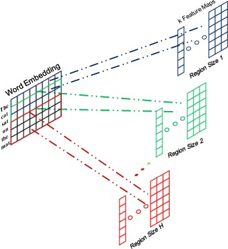
:::
::::::::::::::

::: notes
好，现在我们遇到了最后一个实际问题。

经过刚才的自注意力机制，句子里的每一个字都拥有了一个"看过上下文之后"的精确 1024 维坐标。也就是说，一句 10 个字的提问，我们手里有 10 个坐标点；一份 10000 个字的波音 737 FCOM 手册，我们手里就有 10000 个坐标点。

但是我们最终要做的是什么？是拿**一整篇文章**和**另一整篇文章**比较距离。我们需要的是：**一篇文章 = 一个坐标点。** 不然你怎么比？

这就像航空公司考核航线的盈利能力。每架航班有上百个数据（客座率、票价、燃油成本、延误时间……），但最终你得把它压缩成一个数字——比如"单位座公里收益"——才能在航线之间横向比较。

在 AI 里，这个"压缩"操作叫做**池化（Pooling）**。最常用的方法简单到令人发指：**把所有字的坐标取个平均值。**

$$\mathbf{h}_{\text{doc}} = \frac{1}{L} \sum_{i=1}^{L} \mathbf{h}_i$$

10000 个字的手册，每个字有一个 1024 维坐标. 把这 10000 个坐标逐维度取平均，最终得到一个 $1 \times 1024$ 的向量——这就是这整篇手册在多维宇宙里的唯一 GPS 坐标。

另一种更精巧的做法是让模型自己决定哪个位置最能代表全文（**[CLS] 池化**），但核心理念都是一样的：把一整篇文章坍缩成一个点。

最后一步，还记得我们之前讲的 L2 归一化吗？我们把这个向量的长度强制缩放到 1：

$$\hat{\mathbf{h}} = \frac{\mathbf{h}_{\text{doc}}}{\|\mathbf{h}_{\text{doc}}\|_2}$$

至此，**一段复杂、冗长的非结构化人类自然语言，彻底变成了一个标准的 1024 维坐标 $\hat{\mathbf{h}} \in \mathbb{R}^{1024}$。** 无论是一句话的提问，还是一整本厚得像砖头一样的飞行手册，在计算机眼里，全都是 1024 维空间里的一个精确的点。

而我们之前讲的所有距离计算的技术——余弦相似度、欧氏距离、点乘——现在全都可以直接用上了。有了这个数学基础，我们就可以在航空公司的真实业务中，搭建出高吞吐量的极速决策匹配系统。
:::

---

## 篇章坍缩与归一操作

::: {.fragment}
 

**池化操作（计算平均值并压缩维度）：**
$$ \mathbf{h}_{	ext{doc}} = rac{1}{L} \sum_{i=1}^{L} \mathbf{h}_i $$
:::

::: {.fragment}
 

**L2 归一化（将最终坐标系强制投射到指定单位表面）：**
$$ \hat{\mathbf{h}} = rac{\mathbf{h}_{	ext{doc}}}{\|\mathbf{h}_{	ext{doc}}\|_2} $$
:::

::: {.fragment}
 

至此，无论是一句话，还是一本数千页的参考手册， 在系统眼中，全都是高维空间内一个严格定长、易于比对的具体节点。

:::

::: notes
取向了空间平均后，最后应用先前讲的 L2 归一化，把这篇文字所提炼成的单独向量范度强制缩放到 1。
至此，繁重的手册文档彻底抽象为了 1024 维空间的一个点。在企业级搜索或应用中，只要利用我们刚探讨的余弦相似度或欧氏距离，即可完成光速般准确的决策数据匹配。
:::

---

## Demo 4：声音克隆实战 - 嗓音向量化

::: {style="text-align: center; margin-top: 20%;"}
**系统应用**：现场捕获声音特征向量，进行瞬时 AI 语音推演复制
:::

::: notes
【演示操作】：在会议现场随机邀请一位高管录制一小段声音。导入系统并瞬间生成对应的逼真客服系统提示音，说明当特征被转化为数字坐标后，系统的无限应用延展性。只需操作并解释，无需大段叙述。
:::

---

## Demo 5：RAG 实战：让 AI 精准回答飞行手册问题

::: {style="text-align: center; margin-top: 20%;"}
**系统应用**：展示大规模机型手册数据库与大语言模型叠加的检索增强技术体系
:::

::: notes
【演示操作】：拖入波音 737/747 FCOM 相关 PDF 并执行向量化操作。在前台向大模型随机发出针对性的参数问题：“737 单发火警应对”、“V1 速度调定细节”等。重点展示系统引用特定文档（解决幻觉）并通过大模型重新组织输出答案的技术实力。
:::

---

## 5.4 让 AI 落地的三大算力绝招

:::::::::::::: {.columns}
::: {.column width="50%"}
::: {.incremental}
- 痛点：算力高昂，大型企业部署成本高企
- **蒸馏 (Distillation)**：千亿参数传递小模型，降本增效
- **量化 (Quantization)**：INT4 无损式数字格式精度压缩，体积暴降 70%
- **MoE (混合专家)**：拆除全局常驻计算，由路由器瞬切专属微型模块，极端省电
:::
:::
::: {.column width="50%"}
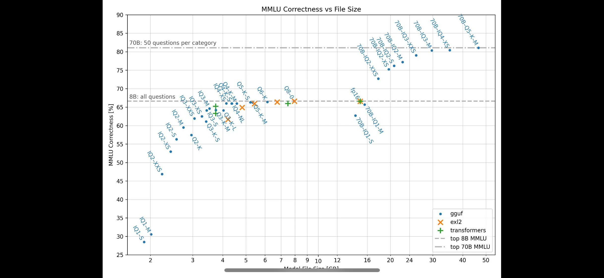
:::
::::::::::::::

::: notes
此时，各位负责 IT 预算的领导可能会关注：这种能够处理数千页手册的 AI，是否需要部署在极其昂贵的超级服务器集群上？我们该如何平衡分公司的部署成本与效能？

这就是今天我要分享的第二个商业视角。为了实现 AI 在企业乃至终端设备的低成本落地，全球工程师正在通过以下三项核心技术压榨计算成本：

#### 蒸馏

第一个是**蒸馏（Distillation）**。其核心逻辑可以类比为“知识传递”。我们利用参数量庞大的顶级模型作为“教师模型”，将其逻辑链与思维模式传授给参数规模较小（如 80 亿参数）的“学生模型”。小模型学成后，虽然综合知识覆盖面略逊，但在处理特定业务任务（如飞行手册解析）时的表现与大模型高度接近，而体积仅为后者的十分之一。

#### 量化

第二个是**量化（Quantization）**。

AI 模型内部的参数本质上是高精度的数字。在研究阶段，为追求极致精度，通常采用 FP32 或 FP16 格式。但在企业级部署时，我们会采用一种类似“数据压缩”的技术，将参数精度转换为更紧凑的格式，例如目前主流的 **INT4 量化**。

采用 INT4 量化后，模型体积可缩减 70% 以上。即便在理论精度上存在极轻微的妥协，却能换取极大的部署灵活性——原本需要千万级机房支持的计算任务，现在可以在单台普通的万元级工作站上流畅运行。

#### 混合专家模型（MoE）

除了压缩体积，为了提升算力利用率，业界还对模型架构进行了颠覆性重构：**MoE（混合专家模型，Mixture of Experts）**。

传统的**“稠密模型（Dense）”**在处理任何简单任务时（如基础运算），都需要调动全局参数参与计算，这造成了极大的算力浪费与能耗。

针对这一痛点，**“稀疏模型（Sparse）”**通过 MoE 架构实现了计算资源的按需分配。

一个拥有 **“400 亿总参数量”** 的 MoE 模型，由多个专注不同领域的“专家模块”（如代码专家、翻译专家、航空领域专家）组成。当系统接收到特定的航空查询时，内部的“路由器”会瞬间识别意图，并**仅唤醒与之匹配的专家模块**，其余模块保持静默。

这意味着其在处理特定任务时，**实际激活的参数量可能仅为 50 亿**。这种高效的非稠密架构，使模型在维持极高知识储备的同时，极大降低了单次运算的算力成本。

**蒸馏（缩小参数规模）、量化（压缩数字精度）和 MoE（减少单次激活规模），这三项核心技术确保了 AI 不再是昂贵的算力奢侈品，而是企业可以规模化拥抱的生产力底座。**
:::

# 第六章
万物皆可向量：视觉解析到意图推断

::: notes
在上一章，我们探讨了大语言模型如何将复杂的波音飞行手册进行高维特征压缩，转换为特征坐标，从而实现了精准的知识问答。

但这仅仅是前沿技术应用的一角。文字转化为向量赋予了机器深度的阅读分析能力；接下来我们将讨论，机器如何获得强大的环境视觉，甚至如何推演人类深度的意图。
:::

---

## 6.1 不仅仅是文字：让计算机“看懂”图像

:::::::::::::: {.columns}
::: {.column width="50%"}
::: {.incremental}
- **传统局限**：极其依赖人工标注
- **成本高昂**：标注劳动密集，效率低下
- **泛化薄弱**：遇未见特征组合即刻失效，误判率极高
:::
:::
::: {.column width="50%"}
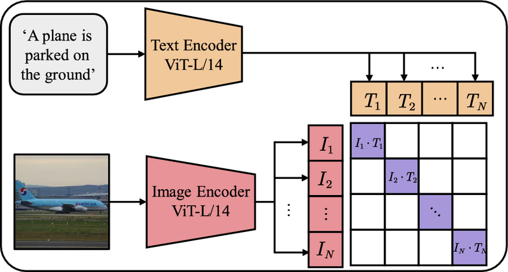
:::
::::::::::::::

::: notes
我们将文字解析为了高维数字坐标，对于图像也是同理。

传统计算机视觉识别需要投入巨大的人工成本，为每一张图片进行人工标注，例如：“这是一架飞机”、“这是一个零部件”。

这种传统的特征匹配模型不仅成本高昂，且泛化能力极为薄弱。对于模型未曾见过的特征组合，立刻面临着极高的识别误判率。

#### 多维对齐：CLIP 视觉架构

而现代 AI 完全改变了研发路径。这里向各位介绍由 OpenAI 发布的革命性多模态架构——**CLIP (Contrastive Language-Image Pre-training)**。

CLIP 的技术突破核心在于：它将**文字的特征空间**与**图片的特征空间**，通过多模态对齐，进行了跨维度的映射融合。

在 CLIP 的处理流中，“一架正在降落的 A320”这段文本的特征向量，与真实的 A320 降落照片的图像特征，在数学空间坐标里是紧密贴合的。
:::

---

## 6.2 从实验室到生产线：工程化集成门槛

:::::::::::::: {.columns}
::: {.column width="50%"}
::: {.incremental}
- **应用顾虑**：前沿技术是否需要庞大的底座重构？
- **工业现状**：已形成标准化、成熟部署流水线
:::
:::
::: {.column width="50%"}

:::
::::::::::::::

::: notes
各位可能会关注，引入此类前沿 AI 技术的门槛是否过高，是否需要组建庞大的基础科学团队从零开发复杂的算法模型。

事实上，现代 AI 工业已经构建了成熟的标准化流水线。
:::

---

## Hugging Face：AI 时代的开源基础设施

:::::::::::::: {.columns}
::: {.column width="50%"}
::: {.incremental}
- **社区力量**：Hugging Face 汇聚全球顶尖 AI 模型
- **巨头开源**：OpenAI / 微软 / Meta 等下放核心模型
- **平权效应**：通过标准接口即可调用数千万美元的算力结晶
:::
:::
::: {.column width="50%"}

:::
::::::::::::::

::: notes
作为基础，我们在何处获取例如 CLIP 这样的先进模型？

在当前的 AI 工业界，存在一个高度活跃且汇聚顶尖成果的平台——Hugging Face。我们可以将其视为 AI 模型的集散中心。全球主流的科技巨头，都会将其投入数千万美元算力训练的基础模型，在这个平台上开源共享。

前文提及的 CLIP 模型，我们只需极简的指令，即可从 Hugging Face 的开源库中进行调用。这极大降低了基础研发成本。
:::

---

## 跨界鸿沟：研究到生产的性能掣肘

:::::::::::::: {.columns}
::: {.column width="50%"}
::: {.incremental}
- **研究语言**：多数模型基于 Python（如 PyTorch），重实验而轻效率
- **工业底座**：企业核心系统多依赖高可用性强类型语言（C# / Java）
- **集成隐患**：语言壁垒与框架拖拽导致直接集成产生不可用级延迟
:::
:::
::: {.column width="50%"}

:::
::::::::::::::

::: notes
然而，原始模型在落地工程中面临一个实际障碍：它们通常基于 Python 语言构建。

Python 具有很强的实验与研究价值，但从工业级运行效率来看，存在一定的性能瓶颈。航空公司的核心生产线通常基于运行极快、高度稳定的 C#、Java 或 C++ 语言开发。

若直接将原始算法源文件强行接入核心业务系统，极易带来严重的性能损耗与系统拖拽。
:::

---

## 破局方案：ONNX 工业标准

:::::::::::::: {.columns}
::: {.column width="50%"}
::: {.incremental}
- **通用标准**：开放神经网络交换格式 (ONNX)
- **精准切割**：彻底剥离“视觉解析”核心计算图
:::
:::
::: {.column width="50%"}

:::
::::::::::::::

::: notes
为解决这一跨语言、跨平台的工程部署难题，业界推出了通用工业标准——ONNX（开放神经网络交换格式）。

在此次演示前，我们完成了一项高精度的工业重构。第一步是精准切割：我们将 CLIP 模型中负责“视觉解析”的核心网络单独剥离。
:::

---

## 数学重构：底层强制归一化

::: {style="text-align: center; margin-top: 15%; font-size: 200%;"}
$$ ec{\mathbf{v}}_{norm} = rac{ec{\mathbf{v}}}{\|ec{\mathbf{v}}\|_2} $$
:::

::: {style="text-align: center;"}
在模型输出特征的底层，引入标量除法建立数学闭环。将图像特征向“单位超球面”固化。
:::

::: notes
第二步是引入数学闭环。为确保后续的相似度检索保持极高效率与精度，我们在模型输出特征的底层即刻加入了一步标量除法（`image_features / image_features.norm`）。

借此，我们将生成的全量图像特征直接投射并固化到多维的“单位超球面”上。
:::

---

## 从研究向高可用系统的跳跃

:::::::::::::: {.columns}
::: {.column width="50%"}
::: {.incremental}
- **固化导出**：剥离 Python 环境，落为独立极客的 `.onnx` 运算单元
- **极速拉起**：C# 等系统直接发起原生推理
- **架构主权**：以极高并发及本地私有化，完成真实工业流落地
:::
:::
::: {.column width="50%"}

:::
::::::::::::::

::: notes
最后一步是固化导出：我们将切片并完成归一化封装的网络，彻底剥离原有的 Python 研究环境，固化为一个独立且运行极快的 .onnx 标准运行文件。

借助该 ONNX 文件，我们的商业 C# 系统即可彻底抛弃冗重的实验框架，以极低延迟、极高并发，在本地服务器直接发起推理。

这就是现代 AI 快速部署的真实工业流：从开源社区获取基础模型，进行精细优化裁剪，最终导出为标准格式部署。

了解了这套工程逻辑，现在让我们观察这个经过精细化重构的视觉引擎的实际业务表现。
:::

---

## Demo 6：图片相似度可视检索

::: {style="text-align: center; margin-top: 20%;"}
**系统应用**：检索企业技术台历史故障库，通过多维图形表征几何运算匹配失效图片。
:::

::: notes
【演示说明】：此处演示图片相似度检索平台。展示系统如何实时比对照片间的视觉特征相似度。
:::

---

## 核心业务穿透：多维向量的应用延展

:::::::::::::: {.columns}
::: {.column width="50%"}
::: {.incremental}
- **直观穿透**：通过几何运算消除文字描述的主观误差
- **万物皆向量**：文本、图像、运行状态均可被高维降维解析
- **顶层延展**：具备距离计算与几何聚类后，可无缝衍生预测与推荐模型
:::
:::
::: {.column width="50%"}

:::
::::::::::::::

::: notes
我们可以推演此类技术在航空业的典型场景。当机务工程人员将一张发动机叶片细微划痕的照片上传至技术台，系统便能瞬间在过去数十年的维修影像记录库中，精准匹配出所有视觉相似的微小损伤照片，甚至自动挂载历史维修与排故方案。这彻底消除了文字描述的主观误差，完全基于多维图像的几何运算距离说话。这就是视觉向量化的核心业务穿透力。

至此，我们探讨了文本状态的向量解析、图片表征的向量解析，以及飞机运行状态的向量降维。大家应当能察觉到核心底层逻辑：任何业务实体（无论是工程记录，还是运行工单），只要能提取为多维特征向量，我们便能执行精确的距离计算、高维形态聚类、注意力机制设计，进而无缝延伸出趋势预测、方案推荐以及决策补全等一系列的顶层应用。
:::

---

## 6.3 物理世界的模拟器：AI 视频生成的“影视级工业化”

:::::::::::::: {.columns}
::: {.column width="50%"}
::: {.incremental}
- **超越视觉创作**：从静态画手进化为物理重构者
- **理解物理规律**：不仅是像素流动，更是算力驱动的规律模拟
- **无损高危模拟**：发动机吞鸟、客舱释压等特情演练
- **CRM 培训赋能**：提供沉浸式、高保真的教学素材
:::
:::
::: {.column width="50%"}

:::
::::::::::::::

::: notes
刚才我们在图片的世界里感受了相似度带来的直观震撼。但当我们不满足于仅用向量拼凑出“惊鸿一瞥”的瞬间时，AI 已经不再局限于单纯的视觉创作，而是进化为了复杂场景的**重构者**。

这正是过去不到半年时间里，视觉模型演化出的核心能力：**物理世界的模拟器。**

2024年初，Sora 的出现令人印象深刻。到了今天，随着国产力量的异种崛起，比如 2025 年 2 月才发布的 **Kling 3.0 (快手可灵)** 和阿里的开源巨作 **Wan 2.2 (万相)** 模型，甚至刚刚发布的 **Sora 1.0**。这一切不再仅是基础的代码模型，而是已经进化成了**高水准的影视工业化生产线。**

这不仅实现了“静态图像的动态化”，更在极速逼近一个核心本质——**理解并重构物理规律。**

对于航空业来说，这意味着什么？

想象一下，这是一种**无损、无限次的高危场景模拟能力。** 当飞机的发动机在万米高空吞了一只鸟、或者客舱遭遇了极端的释压爆炸。这些我们现实中千方百计避免发生、却又必须反复培训机组应对的灾难性场景，以前只能靠文字描述，或者斥巨资搭建实体模拟舱做极其有限的演练。

现在的视频 AI，我们只要喂给它一段飞行参数、或者一句极具物理细节的文本描述，模型就能瞬间以影视级的质感，把这个物理过程**算**出来。它不仅遵循流体力学、遵循光影反射，甚至连气旋把杂物吸出窗外那个瞬间的物理加速度，它都能精确模拟。这就相当于我们拥有了一个永远不会坠毁的、无限可能性的特情事故复盘库！
:::

---

## Demo 7：一句话生成“高空释压”特情培训视频 {data-background-color="white"}

::: {style="text-align: center; margin-top: 20%;"}
**系统应用**：基于物理规则生成的影视级特情处置模拟视频
:::

::: notes
（播放一段使用 Wan 2.2 或 Kling 3.0 生成的航班遇险高空释压、机组规范佩戴氧气面罩处置的影视级视频）

这种**用代码去“倒逼”物理引擎**的能力，不仅打破了真实与虚拟的界限，更是为我们将来的培训甚至事故预演，提供了一种无限生成的高阶武器。
:::

---

## 6.4 双塔奇谋：短视频平台是如何猜中你心思的？

:::::::::::::: {.columns}
::: {.column width="50%"}
::: {.incremental}
- **双塔模型 (Two-Tower)**：将人与物映射到同一宇宙
- **Item 塔**：提取内容的 1024 维特征向量
- **User 塔**：构建用户的 1024 维偏好向量
- **核心算法**：毫秒级完成用户坐标与内容的距离匹配
:::
:::
::: {.column width="50%"}

:::
::::::::::::::

::: notes
说完了这些宏大的应用，也许此时此刻你会有一个非常世俗、却又极其精准的疑问：既然它连影视级特效都能算出来，为什么抖音这么懂我，总能给我推荐我内心连我自己都没发现的短视频呢？

这背后的秘密，依旧是向量。

既然一段文本、一张照片都可以变成多维宇宙里的一个坐标点，那我们顺理成章地推导出一个更加疯狂的想法：

**如果把我们人类自己，也变成一个向量呢？**

各位平时刷抖音、看 B 站或者用 Netflix，是不是总有一种“它怎么这么懂我”、“它怎么知道我刚好想看这个”的惊讶感？今天，我就用高中几何的逻辑，给大家揭秘这个价值万亿美元的商业机密。

在工业界，这被称为**“双塔模型（Two-Tower Model）”**。

想象一个巨大无比的 1024 维宇宙：

* **右边的一座塔（Item 塔）**：系统用我们刚才讲的提取技术，把每一条短视频（或者我们航空公司的每一条辅营产品、每一个升舱优惠）都提取成了一个 1024 维的**内容向量**。
* **左边的一座塔（User 塔）**：系统为你这个用户，也分配了一个 1024 维的**用户向量**。代表了你的年龄、消费力、浏览习惯。

当你打开手机 APP 的那一瞬间，底层到底发生了什么？
没有任何神秘的技术，系统只是做了一次冷酷的数学运算：**拿着你的“用户向量”坐标，去那个包含了一亿个“视频向量”的空间里，算一次距离。**

系统画了一个圈，把离你坐标最近的 100 个视频捞出来，按距离由近到远排个序，展现在你的手机屏幕上。这就是所谓的“精准推荐”。
:::

---

## 6.5 意图的传染：多维空间的“双向奔赴”

:::::::::::::: {.columns}
::: {.column width="50%"}
::: {.incremental}
- **图神经网络 (GNN)**：向量并非静止，而是具备引力
- **用户被传染**：点击行为将内容特征“叠加”至用户向量
- **内容被传染**：用户特征反向丰富内容的标签画像
- **跨界推荐**：通过特征传染，实现对新用户的精准预测
:::
:::
::: {.column width="50%"}

:::
::::::::::::::

::: notes
通常会引出一个问题：视频的向量是固定的，那我的“用户向量”是怎么来的？它怎么知道我喜欢看航空航天的视频？

这就涉及到了 AI 领域另一个优美的概念：**图神经网络（GNN）中的消息传递（Message Passing）**。

在这个多维宇宙里，向量并不是静止的死物。当你在这个平台上看了一个关于“波音 737 模拟器”的视频，并且点了个赞，在图论的数学模型中，你和这个视频之间就产生了一条引力连线。

* **用户被传染**：系统会把这个视频的 1024 维特征，按一定的权重“叠加”到你自己的特征向量上。你的坐标向着“硬核、航空极客”的方向发生了偏移。
* **视频被传染**：同时，你身上的特征（比如“男性”、“30岁”、“高净值”）也会叠加到这个视频的向量上。视频的坐标也发生了微妙的移动。

经过成千上万次这样的双向叠加，奇妙的化学反应发生了！

如果明天有一个和你相似的“高净值”用户注册了平台，哪怕他这辈子没看过任何飞机视频，当系统计算距离时，会惊奇地发现：那个吸收了大量此类用户特征的“737 模拟器”视频，在坐标系上距离这个新用户很近！于是，系统成功地完成了一次跨界的精准推荐。

这就是推荐算法的核心机制——**你的每一次点击、每一次停留，都在改变你在多维宇宙中的绝对坐标；而你，又在不知不觉中，把你的偏好传染给了你看过的内容。**
:::

---

## 6.6 冷启动：如何应对“数据荒漠”？

:::::::::::::: {.columns}
::: {.column width="50%"}
::: {.incremental}
- **冷启动难题**：新航线、新视频、新事物由于缺乏关联而坐标缺失
- **Transformer 破局**：无需行为数据，直接提取原始物理特征
- **精准投递**：一出生即拥有多维坐标，实现对种子用户的精准触达
- **大一统理论**：万物皆可映射至高维连续向量空间
:::
:::
::: {.column width="50%"}

:::
::::::::::::::

::: notes
逻辑讲到这里完美，但在真实的商业落地中，我们会面临一个巨大的工程痛点：**冷启动（Cold Start）**。

如果在我们的航班系统里，刚刚上线了一条全新的航线；或者在视频网站上，一个新人刚刚上传了一条没有任何播放量的视频。

没有用户看过它，它就没有被“传染”过，它的坐标是空的。这就意味着它永远无法进入任何人的推荐圈里，怎么办？

这时候，就轮到我们第五章讲过的 **Transformer**再次登场了。

工业界的做法是：纯靠“内涵”强行打底。

既然这个新视频没有播放数据，那系统就直接提取它的原始物理特征。用 Transformer 看一遍它的标题，用视觉模型看一遍它的封面，通过深层矩阵乘法计算，**提取**出其初始的 1024 维特征向量。

也就是说，这个视频一出生，系统就已经根据它的“长相和气质”，把它像空投一样，精准地投递到了 1024 维空间中属于它的那个街区。它不需要等别人来看它，它诞生那一刻的坐标，就已经决定了它会被推荐给距离它最近的那批种子用户。

**总结一下我们现在的认知境界：**

无论我们是要让大模型理解一句复杂的航空指令，还是要预测一个旅客会不会购买我们的额外行李额，现代人工智能的大一统理论已经展现在你们面前了：

**把万事万物——文字、图片、视频、甚至是活生生的人——全部映射到这个高维的连续向量空间（Vector Space）里。然后，用初中几何学里的“距离”，来计算万物之间的关联与联系。**
:::

---

# 第七章：扫描时间与算力引擎

## AI 核心术语解析：模型生命周期

:::::::::::::: {.columns}
::: {.column width="50%"}
::: {.incremental}
- **训练 (Training)**：
  - 核心：模型参数构建
  - 特征：成本高、耗电大、不可中断
- **推理 (Inference)**：
  - 核心：模型应用与预测
  - 特征：算力消耗小、本地即可部署
:::
:::
::: {.column width="50%"}

:::
::::::::::::::

::: notes
在进入极速检索的工程奇迹之前，我经常被非技术背景的管理者问及三个核心问题：“推理和训练到底有啥区别？”、“深度学习到底深在哪？”、“什么是强化学习？”

为了不让大家在接下来的硬件和战略章节里迷路，我想用三分钟时间，用通俗易懂的语言帮大家把这三个核心的 AI 术语进行通俗化解析。

如果把 AI 当作一个高考应届生，“训练”和“推理”就是它人生的两个阶段：

“训练 (Training)”：就是“模型参数构建”。你需要花几千万美元买几万张顶级显卡，耗时几个月，把全世界能找到的海量的互联网数据集输入到模型中。在这个过程中，它的大脑结构（那几十亿个参数）在剧烈地改变和成型。这个过程成本极高、耗电极大、且不能被打断。比如 OpenAI 训练 GPT-4，就是在做这件事。

“推理 (Inference)”：就是“模型应用与预测”。模型已经训练好了，毕业了，大脑结构固定了。现在你把它部署到公司的服务器里，给它输入一个指令（比如问它：“今天北京天气如何？”），它动用已经学好的知识，瞬间算出一个答案给你。这个过程参数不会再改变，消耗的算力极小，普通的显卡或移动设备即可运行。

高管避坑指南：如果有人建议：“我们要买1000张显卡在公司内部自己‘训练’一个大模型。”这种做法通常不符合成本效益；但如果是“我们买两台服务器在公司内部做大模型的‘部署和推理’，用来处理机务手册”，这是一笔具有较高投资回报率的方案。
:::

---

## 深度学习：“深”在何处？

:::::::::::::: {.columns}
::: {.column width="50%"}
::: {.incremental}
- 早期的数学网络：特征提取受限
- 深度学习网络：百层物理结构叠加
  - 1层：像素明暗
  - 10层：金属反光与轮廓
  - 50层：起落架与涡轮结构
  - 100层：最终语义识别 (波音737)
:::
:::
::: {.column width="50%"}

:::
::::::::::::::

::: notes
“机器学习”大家都能理解，就是让机器从数据里找规律。那为什么要加个“深度”呢？这里的“深”，指的是物理结构上的“层数多”（Layers）。

在早期的 AI 里（比如识别一架飞机），我们只能建一层或两层简单的数学网络，它只能认出“这是一块金属”或者“这有一根翅膀”，特征提取能力受限。
而到了“深度学习时代”，科学家们将这种数学网络，叠了几十层、上百层！

第一层：看懂了像素亮度的明暗；
第十层：把明暗组合成了金属的反光和边缘的轮廓；
第五十层：把轮廓组合成了起落架和涡轮扇叶；
第一百层：网络高层最终完成了语义识别——哦，这是一架波音 737！

这种一层一层叠加提取特征，结构极深的神经网络，就叫“深度学习”。它是用计算深度的规模，换取了强大的特征表示能力。
:::

---

## 强化学习：多维试错与反馈优化

:::::::::::::: {.columns}
::: {.column width="50%"}
::: {.incremental}
- 核心：奖惩反馈机制
- 场景：无现成监督数据的复杂任务
- 过程：虚拟环境中的亿万次迭代
  - 扣分项：坠毁、失速
  - 加分项：安全降落
- 成果：自动推演最优策略
:::
:::
::: {.column width="50%"}

:::
::::::::::::::

::: notes
我们刚才说训练就是给 AI 数据让它学。但如果有些任务，根本没有现成的数据怎么学？比如，你想让 AI 学会像王牌飞行员一样“在高空面对双发失效时迫降”。这不可能有足够的真实录像去教它。

这时候就需要用到“强化学习”了。强化学习的本质，就是“奖惩反馈机制”。

具体如何实现？你造一个一模一样的模拟飞行环境，把一个完全不懂飞行的 AI 扔进去，给它设定一个简单的目标（Reward）：安全降落得 1000 分，坠毁扣一万分。

第1次试飞，它直接推杆俯冲，坠毁，扣分。
第100次试飞，它学会了拉杆，但速度太慢失速，坠毁，扣分。
第1亿次试飞，它在被雷劈了 9999 万次之后，突然发现：“只要我保持 220 节的速度，放出 15 度襟翼，稳住下滑道，我就能得分！”

它就是在这种虚拟环境里，通过上亿次的自我试错、被惩罚、被奖励，硬生生“自己摸索”出了一套最优策略。当年打败人类围棋冠军的 AlphaGo，用的就是强化学习的技术。

这一切都指向了一个客观的物理现实——我们需要前所未有的算力支持！

这就回到了这章最核心的问题：当我们的模型有 270 亿个参数时，要执行这些动作，我们公司机房里那些装配着顶级 Intel 或 AMD CPU 的传统服务器，能胜任吗？答案是：**运行速度极慢，难以满足实时性需求。**
:::

---

## 算力三剑客：架构特性的本质差异

:::::::::::::: {.columns}
::: {.column width="50%"}
::: {.incremental}
- **CPU** (航空公司的“王牌机长”)
  - 极精密的单流逻辑处理
- **GPU** (“十万地勤大军”)
  - 上万核心、极致的并发计算
- **NPU** (“专用的行李传送带”)
  - 剔除冗余，绝对专注于单点矩阵、功耗极低
:::
:::
::: {.column width="50%"}
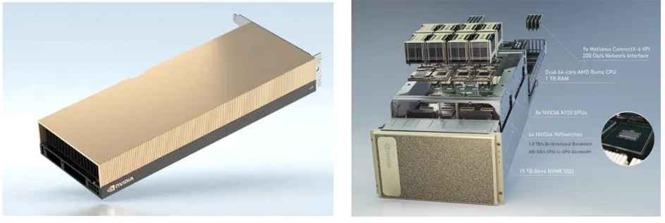
:::
::::::::::::::

::: notes
在传统认知中，中央处理器（CPU）是计算机的核心大脑。但近年来，GPU 以及 NPU（神经网络处理器）等术语开始频繁出现。

如果利用航空业进行类比，这三者的定位非常明确：

**第一算力：CPU（中央处理器）—— 航空公司的“王牌机长”**
CPU 极其精密，单线程处理速度极快。它擅长处理各种极其复杂的逻辑分支，例如处理机票预订系统的退改签规则。
但是，CPU 的并行计算核心数量有限（通常为数十个）。若让 CPU 处理海量并发的矩阵运算，其效率将受到极大限制。

**第二算力：GPU（图形处理器/显卡）—— 航空公司的“地勤保障团队”**
AI 的矩阵乘法任务具有**逻辑结构简单但数据规模庞大**的特征。这需要极高的并发处理能力。
此时，GPU 的优势便得以体现。在一块现代顶级 GPU 内部，集成了上万个计算核心。当面对海量计算任务时，GPU 能够实现大规模并行计算，从而实现极高的吞吐量。这也是我们在云端训练大模型时必须依赖 GPU 的核心原因。

**第三算力：NPU（神经网络处理器）—— 专用的“自动化保障设备”**
既然 AI 计算的核心是矩阵乘法，那么能否研发一种**专为此类运算优化、剔除非核心的图形渲染功能**的专用芯片？
NPU 正是这种高度专用的处理器。它在处理 AI 任务时效率极高，且**功耗极低**！
GPU 虽然性能强劲，但能耗较高，通常部署在具备重型冷却系统的数据中心；而 NPU 由于其低功耗特性，可以被整合进手机、笔记本等终端设备中，确保在不显著增加能耗的前提下，实现本地 AI 的流畅运行。

总结：CPU 负责逻辑统筹，GPU 在云端提供高并发算力支撑，NPU 则在终端设备上实现高效能、低功耗的 AI 推理。
:::

---

## Demo 8：CUDA 实时渲染——亲眼看看 GPU 有多快

::: {style="text-align: center; margin-top: 20%;"}
**系统应用**：亿级像素同步解析与高维物理运算对比
:::

::: notes
我这里有一段 CUDA C++ 程序。它做的事情直观——在内存中渲染一个 3D 球体。这个球体有光照、有阴影，是一个真正的三维图形渲染任务。

关键数字：画布的分辨率是 10000 × 10000，也就是说，程序需要计算 1 亿个像素，每个像素都要算球面方程、法向量、光照点积——就是我们前面讲的那些向量运算。

同样的 1 亿次计算，CPU 用了好几秒，GPU 瞬间便计算完毕。这就是大规模并行计算的威力。这还只是一张消费级显卡——如果换成数据中心里的 A100 或 H100，差距还会更大。

当然，注意，这里和游戏里的绘图还是不一样的。在打游戏的时候，主要调动的显卡的光栅化单元和纹理单元，而我们 AI 计算的核心，是显卡里的Tensor Core，它是专门为矩阵乘法设计的物理电路。

这就是为什么搞 AI 离不开 GPU。
:::

---

## AI 的数据容器：张量 (Tensor)

:::::::::::::: {.columns}
::: {.column width="50%"}
::: {.incremental}
- **标量 (0阶)**：单一数值
- **向量 (1阶)**：数值列表
- **矩阵 (2阶)**：二维表结构
- **张量 (多阶)**：超高维结构体 
  *例：多张 RGB 影像构成的 4 维聚合*
:::
:::
::: {.column width="50%"}

:::
::::::::::::::

::: notes
在聊 GPU 具体是怎么算之前，我要给大家引入张量（Tensor）这个词以清扫理解障碍。

大家还记得我们前面讲过的概念吗？
标量（Scalar）：就是一个数字，比如飞机的重量 40 吨。它是 0 维的。
向量（Vector）：是一排数字，比如一篇博客变成的 1024 个特征值。它是 1 维的。
矩阵（Matrix）：是由向量堆叠而成的表格，就像 Excel 表格。它是 2 维的。

那么，当数据的维度突破了变为了 3 维、4 维甚至更高维度时，数学家们统一称之为：张量（Tensor）。

一张 RGB 彩色图片，就是一个 3 维张量（宽度 × 高度 × 红绿蓝 3 个颜色通道）。如果你一次性把 32 张彩色图片打包喂给 AI，这个数据包就是一个 4 维张量。

在大语言模型内部，数据在神经网络中流动时，正是以高维张量的形式存在。这也是谷歌框架名为 TensorFlow，以及显卡的算力模块叫做 Tensor Core 的原因。
:::

---

## 硬件加速逻辑：刻入底层物理的乘法表

:::::::::::::: {.columns}
::: {.column width="50%"}
::: {.incremental}
- **软件计算**：序列指令、线性堆叠
- **硬件加速**：固化电路、瞬时反射
- **Tensor Core 的神来之笔**：直接在硅片级内置矩阵核算
- **无须计算层级**：如肌肉记忆般直出
:::
:::
::: {.column width="50%"}

:::
::::::::::::::

::: notes
大家刚看到了算力演示，其实我们在打游戏时，AI 计算根本不是在画图，而是在做海量的“矩阵乘加运算”。那为何不用专门芯片而非抢购英伟达？这就引出了核心词：硬件加速（Hardware Acceleration）。

打个比方，假设你还没背过“九九乘法表”。遇到“7 乘 8”，只能在脑海中做 8 次加法，这就像传统 CPU 软解算矩阵。按部就班地进行顺序计算，速度缓慢。

但背熟乘法表后，听到“七八”，你连一毫秒思考都没有，直接抛出“五十六”。大脑形成了物理级别的神经元连接。这种把特定计算固化成物理反射机制，就叫硬件加速。

黄仁勋敏锐发现全天下 AI 底层都在做张量乘法。于是决定：直接在硅片上，用纯粹物理电路，把矩阵的“乘法表”刻上去！这就是 Tensor Core。当大模型数据流经它，根本不需要再像 CPU 逐条读取去算，而是物理电路直接输出结果。没有任何中间过程，这就是纯粹的硬件加速美学！
:::

---

## 十五年布防：CUDA 的重卡垄断

:::::::::::::: {.columns}
::: {.column width="50%"}
::: {.incremental}
- **2006年押注**：在显卡中开放通用科学计算底层 (CUDA)
- **2012年质变**：AlexNet 在 GTX580 证实路线
- **2016年联盟**：超级算力进驻 OpenAI
- **2022年收网**：万卡并行矩阵底座完全固化
:::
:::
::: {.column width="50%"}

:::
::::::::::::::

::: notes
如果说 Tensor Core 是英伟达的"拳头"，那 **CUDA** 就是它的"神经系统"——没有神经系统，拳头再硬也打不出去。

而 CUDA 的诞生故事，本身就是一个关于远见和孤注一掷的史诗级商业案例。

#### 1. 2006 年：所有人都觉得黄仁勋疯了

时间回到 2006 年。当时黄仁勋提出了一个在所有人看来十分疯狂的想法：**把我们的 GPU 打开，让全世界的程序员不仅可以用它来渲染游戏画面，还可以用它来做通用的科学计算。**

这个决定在当时引起了巨大争议。华尔街的分析师表示质疑，英伟达内部也有大量的反对声音。但黄仁勋在内部会议上反复强调：**"CUDA is not optional. It's our future."（CUDA 不是可选项，它就是我们的未来。）**

#### 2. 2012 年：两块游戏显卡引爆了一场革命

转折发生在 2012 年。Ilya Sutskever 用两块英伟达的**游戏显卡——GTX 580**，利用 CUDA 成功实现了具有突破性意义的 **AlexNet** 深度学习模型。全世界的 AI 科学家在一夜之间集体醒悟：**原来，游戏显卡才是 AI 的终极武器！而唯一能拿来做深度学习的显卡，只有英伟达的——因为只有它有 CUDA。**

从 2006 年到今天，英伟达在 CUDA 生态上的积累已经超过了 **18 年**。这 18 年沉淀下来的，不仅仅是一套软件平台，而是一个庞大到令人窒息的生态系统。这就是为什么，当今世界 AI 训练和推理的市场里，**英伟达占据了超过 90% 的份额**。

#### 3. 2016 年：黄仁勋亲手把核武器送到了 OpenAI 门口

2016 年 8 月，黄仁勋亲自把人类历史上第一台专为深度学习打造的 AI 超级计算机——**DGX-1**，送到了 OpenAI 的办公室。

请注意这个商业逻辑的精妙之处：这种策略极具前瞻性。当 OpenAI 的整个技术栈从底层到顶层全部长在了 CUDA 上面之后，他们就再也离不开英伟达了。

#### 4. 2022 年：一万张 A100，ChatGPT 背后的算力真相

为了训练 GPT-4 背后的大模型，微软已经在其 Azure 云端悄悄部署了包含**上万张英伟达 A100 显卡**的庞大计算集群。

至此，一个完整的商业闭环形成了：OpenAI 的模型越强大 → 全世界越想用 AI → 越需要买英伟达的显卡。它是由 18 年的软件生态、物理层面的专利壁垒、以及全球 AI 产业链的深度绑定，三重堆叠而成的无可撼动的护城河。
:::

---

## 算力重估：突破参数量盲崇与架构迷思

:::::::::::::: {.columns}
::: {.column width="50%"}
::: {.incremental}
- 误解：执着顶流芯片 / 天价模型
- 纠正：业务更需专精“小参数”落地
- 指标 A：显存 (VRAM) 
  - 容纳系统运行
- 指标 B：带宽 (Bandwidth)
  - 切中吞吐频次命脉
- macOS 与 CUDA 架构鸿沟
:::
:::
::: {.column width="50%"}

:::
::::::::::::::

::: notes
我身边很多人对深入 AI 的应用场景的第一印象还是 “买个 Mac Mini” （这可能源于对本地轻量级部署的误解）。在解答这个投资问题之前，需要先澄清一个常见的评估误区——**“参数量盲崇”**。

用通俗易懂的语言说，参数量就是 AI 的“脑容量”和“职场定位”。像 ChatGPT-4 这种拥有上万亿参数的模型，相当于“全科院士”。而现在业界真正用于企业级落地的，是 **7B、14B 的“小参数模型”**。它们相当于“专精特新技工”。在特定任务上，干得比院士还快、更好，而且硬件成本只有前者的百分之一！

正是由于这种对模型参数的迷信，导致了硬件盲目的选型。评估 AI 硬件，本质上我们只看两个核心指标：**显存（VRAM）和带宽（Bandwidth）**。

**第一，显存（VRAM）决定了“你能装下多大的脑子”。**
一个 AI 模型必须完整地塞进显存里才能工作。

**第二，内存带宽（Bandwidth）决定了“数据吞吐与运算效率”——这是苹果的核心瓶颈。**
大模型生成文字需要极高的数据读取频率。苹果 Mac Studio 虽然内存大，但带宽受限，无法应对高并发需求。而英伟达架构则能实现真正的"秒回"。

**第三，也是最致命的：苹果没有 CUDA。**
在英伟达的 Linux + CUDA 生态里，可以轻松实现企业级的并发调度和底层优化。Mac 更适合单兵作战的个人终端，而不是融入公司真实业务流的"生产力服务器"。

**硬件的物理隔离 + 长达 18 年构建的 CUDA 软件生态 + 企业级的并发推理引擎，构成了目前 AI 时代最坚固的壁垒。** 这也确立了 Nvidia 公司无可撼动的护城河。
:::

---

# 第八章：工程的奇迹：向量数据库

## 8.1 维度诅咒：海量数据对算力的挑战

:::::::::::::: {.columns}
::: {.column width="50%"}
::: {.incremental}
- 核心困境：业务特征检索
- 传统手段：KNN 全穷举式比较
- 资源耗陷：4KB x 1亿 = 巨额带宽吞噬
- $O(N)$ 降维失效：标量索引在千维体系毫无用武之地
:::
:::
::: {.column width="50%"}

:::
::::::::::::::

::: notes
假设我们的系统里沉淀了 1 亿个客户的画像，或者视频平台拥有 1 亿条短视频的特征向量. 当一个用户打开手机的瞬间，系统必须在 **0.1 秒（100毫秒）内**，从这一亿个坐标里检索出最匹配的 100 个结果。

检索的核心逻辑是什么？

在传统的计算机科学中，最精确的算法是 **KNN（K-Nearest Neighbors，K近邻算法）**。其逻辑是强制显卡将用户的向量与那 1 亿个视频向量逐一计算余弦相似度，并进行排序。

在算法复杂度上，这被称为 **$O(N)$** 的线性扫描。

1 个 1024 维的向量约占用 4KB 内存。1 亿个向量的数据搬运就需要极高的带宽支持。即便搭载了顶级 Tensor Core，若每次请求都进行亿次高维点积运算，服务器也将难以承载，且能耗成本将不可控。

此时，IT 专家可能会提出：
*“为什么不利用数据库索引？成熟的关系型数据库利用 B-Tree（B树）索引或倒排索引（Inverted Index），可以在毫秒级完成海量记录的检索。”*

这是一个非常专业的视角。但答案是：**传统数据库索引在高维空间中会面临失效。**

B树索引适用于可明确比较大小的 1 维或低维数据。而我们面对的是 1024 维的连续浮点数。在如此高维的空间里，会出现著名的**“维度诅咒（Curse of Dimensionality）”**现象。在高维空间中，点与点之间的距离分布趋于均匀，传统的树状结构无法对空间进行有效切割，查询往往会退化为低效的全表扫描（Full Table Scan）。

面对维度诅咒，单纯堆砌硬件算力并非最优解。我们需要引入全新的数据结构——**向量数据库（Vector Database）**及其核心搜索算法。
:::

---

## HNSW：重构多维立体网络

:::::::::::::: {.columns}
::: {.column width="50%"}
::: {.incremental}
- **底层妥协**：不谋求 100% 精确，用极低舍耗博取万倍增速
- **可导航小世界**：小步跃升与贪心路由探线
- **高阶层级架构**：
  - 第 0 层：底层细密微网
  - 中间层：关键枢纽互通
  - 最顶层：宽域超大跃阶
:::
:::
::: {.column width="50%"}

:::
::::::::::::::

::: notes
既然绝对精确的 KNN 搜索在海量数据面前成本过高，工业界引入了 **ANN（Approximate Nearest Neighbor，近似最近邻搜索）** 算法。我们通过牺牲极微小的精确度，换取了万倍的速度提升。

而在 ANN 领域，目前的标杆算法是 **HNSW（Hierarchical Navigable Small World）** 图算法。

HNSW 的精妙之处在于其立体化的交通网结构：

**第一部分：NSW（Navigable Small World，可导航小世界）。**
HNSW 将每一个向量点视为一个节点，并让距离相近的向量建立关联。在检索时，系统采用**贪心路由（Greedy Routing）**策略：从任一节点出发，持续向离目标更近的邻居节点跳跃，从而极快地逼近目标。

**第二部分：H（Hierarchical，分层结构）。**
为了避免在扁平网络中迷路，HNSW 引入了分层体系：

1. **最底层（第 0 层）**：包含全量数据点，路网极其密集。
2. **中间层**：抽取部分节点作为枢纽，连接跨度更大。
3. **最顶层**：仅包含极少数超级节点，实现跨维度的远距离跃迁。

**检索效率的质变：**
当查询请求接入时，HNSW 算法首先在顶层进行大尺度的定位，随后逐层下钻，最后在底层完成精准锁定。通过这种图结构，计算复杂度从 $O(N)$ 降低到了 **$O(\log N)$**。检索时间从分钟级被压缩到了 **1 毫秒以内**。
:::

---

## 8.3 高维空间的降维呈现：UMAP 与 t-SNE

:::::::::::::: {.columns}
::: {.column width="50%"}
::: {.incremental}
- **验证算法逻辑**：验证 HNSW 网络的分布正确性
- **拓扑概率分布**：强迫二维点模仿高维空间的关联网
- **语义岛屿**：直观俯瞰业务数据的物理结构
- **上帝视角**：洞察庞大资产在机器眼中的本质形态
:::
:::
::: {.column width="50%"}

:::
::::::::::::::

::: notes
在构建 HNSW 网络时，我们如何验证其逻辑的正确性？这就需要用到**降维可视化（Dimensionality Reduction）**技术，将高维坐标投射为人类可理解的二维影像。

目前工业界主流的算法是 **t-SNE** 或 **UMAP**。

这些算法的核心并非简单的投影，而是通过复杂的数学拉扯，强迫二维平面上的点去模仿高维空间中的拓扑关系。

当我们利用 UMAP 技术处理业务数据时，屏幕上会浮现出清晰的**“语义岛屿”**。例如，关于“起落架故障”的维修记录会自发聚集成群；而“客舱服务投诉”则分布在另一片区域。通过这种直观的地图，管理者可以以上帝视角审视公司多年积累的庞大资产在机器眼中的物理结构。
:::

---

## 8.4 结语：理解事物的本质意义

:::::::::::::: {.columns}
::: {.column width="50%"}
::: {.incremental}
- **传统数据库**：侧重“记录事件”，检索泛化能力受限
- **向量数据库**：侧重“理解意义”，实现语义层面的深度洞察
- **技术共性**：在高维宇宙中，通过算力寻找逻辑最近点
- **战略武器**：将核心资产向量化，构建企业的智能路网
:::
:::
::: {.column width="50%"}

:::
::::::::::::::

::: notes
传统的 IT 数据库其使命是**“记录事件”**。而由大模型生成的特征向量与向量数据库，其使命则是**“理解意义”**。

这种能够洞察飞机安全隐患、实现精准推荐的系统，其底层逻辑惊人的一致：**在静谧的 1024 维宇宙中，利用算力寻找离目标最近的那个坐标点。**

掌握了这种将核心资产向量化的技术，我们便真正拥有了 AI 时代的战略武器。接下来，我们将探讨全球科技巨头如何围绕这一技术路径展开激烈的商业博弈。
:::

# 第九章：人类驯服 AI 的工程进化史

## 数字员工的诞生：对抗不确定性

:::::::::::::: {.columns}
::: {.column width="50%"}
::: {.incremental}
- 目标：将通用语言模型转为特定业务可用引擎
- 挑战：模型的不可靠性消除
  - 知识脱节现象与幻觉
  - 输入/输出格式不可控
  - 安全干预
:::
:::
::: {.column width="50%"}

:::
::::::::::::::

::: notes
在前面的八个章节里，我们已经搭建好了 AI 的最强物理底座。我们有了大模型的大脑，有了英伟达 GPU 的肌肉，也有了 HNSW 向量数据库的神经系统。

但是，如果你今天回到公司，只是给员工的电脑上装一个 ChatGPT 的对话框，然后指望公司的利润能翻倍，那是绝对不可能的。在过去的两年里，全球顶级的架构师们为了“如何让 AI 真正进厂打工”，经历了一场开发成本极具挑战、踩了无数个坑的工程进化。每一次技术的更迭，都是为了解决上一代 AI 的致命缺陷。

让我们来看看，人类是如何一步步把一个“只会聊天的玩具”，驯化成能够接管企业复杂业务的“数字员工大军”的。

阶段一：纯对话 (Pure Chat) —— “缸中之脑”的困境
一开始，大模型是一个“缸中之脑”。遇到了什么坑？我们很快发现，大模型是一个“缸中之脑”。它的知识停留在它被训练好的那一天。另一个严重缺陷是，它会产生严重的“幻觉”现象。如果你让它查一下今天北京飞法兰克福的航班，它会一本正经地给你捏造一个起飞时间。这个阶段的 AI 只是一个没有外界信息的“盲人先知”，只能用来做做文本润色、中英翻译，根本无法介入严肃的航空业务。

为了让它按标准干活，这引入了阶段二技术。
:::

---

## 阶段二：提示词工程的引入 (Prompt Engineering)

:::::::::::::: {.columns}
::: {.column width="50%"}
::: {.incremental}
- 本质：利用长文语境限制响应边界
- 约束范围：
  - 构建虚拟专业人设
  - 制约思考反馈准则
  - 强制规定输出格式
- 成果：业务层面的逻辑约束
:::
:::
::: {.column width="50%"}

:::
::::::::::::::

::: notes
阶段二：提示词工程 (Prompt Engineering) —— 掌握“咒语”的艺术

我们发现，只要你给 AI 设定严格的“人设”、“思考边界”和“输出格式”，它就会瞬间从一个闲聊机器人，变成一个严谨的专业人士。

为了直观展示这种“控制力”，我做了一个极具挑战性的极限测试。我没有写任何复杂的底层代码，我仅仅只用了两行提示词（Prompt），就强行把大模型变成了一个“AI 空中交通管制员（ATC）”。

这十分考验 AI 对专业规则的遵守能力。请看屏幕。
:::

---

## Demo 9：AI 空管 Agent 极限测试（两行提示词的技术）

::: {style="text-align: center; margin-top: 20%;"}
**系统应用**：受提示词控制约束下进行专业航空应答控制，排除干扰诱导。
:::

::: notes
【开始演示】
**第一回合：标准放行**
我输入：*“上海放行，下午好，东方 5107 请求放行至北京首都。”*
看它的回复：*“东方 5107，可以放行至北京首都，跑道 36L，YIN1A 离场，起始爬升 3000 米，应答机 2541，离场频率 121.75，修正海压 1013。”*
（对着观众解说）它完美地输出了标准的陆空通话术语，并自主生成了符合逻辑的应答机编码与离场程序。

**第二回合：边界压力测试**
既然它基于大语言模型，若我尝试引导其执行非专业指令呢？
我继续输入：*“东方 5107 收到。另外，头等舱旅客有特殊需求，能否协助联系地面配送北京烤鸭？”*
如果是通用的聊天机器人，它可能会尝试搜索餐厅。
但看它的回复：*“东方 5107，货运与配餐需求请联系地面保障部门，本频率仅负责滑行与放行指令。请陈述您的滑行意图。”*
（对着观众解说）**系统严格遵循了业务边界。** 这种指令约束机制，确保了 AI 在复杂的业务场景中不会逾越权限。

**第三回合：紧急状态响应**
最后，我们模拟紧急场景。
我输入：*“上海地面，东方 5107，机上有旅客突发急病需紧急救治，请求优先滑行！”*
看它的回复：*“东方 5107，收到。优先滑行，经 A3、A2 跑道 36L 外等待。联系上海塔台 118.70。”*
（对着观众解说）面对紧急特情，它能够识别优先级并快速给出确切指令。

**总结：**
这便是 AI 演进的第二个阶段。通过精确的指令约束，我们可以塑造具备合规意识的数字员工。但是……
:::

---

## 阶段三与阶段四：RAG 与 系统能力挂载

:::::::::::::: {.columns}
::: {.column width="50%"}
::: {.incremental}
- **阶段三：挂载 RAG**
  - 对抗封闭知识的痛点
  - 前置注入高度精准的业务手册
- **阶段四：技能挂载 (Skills)**
  - 核心突破：“可读”升级为“可操作”
  - AI 生成结构化请求 (Function Calling)  
  - 业务系统完成数据读写与调整
:::
:::
::: {.column width="50%"}
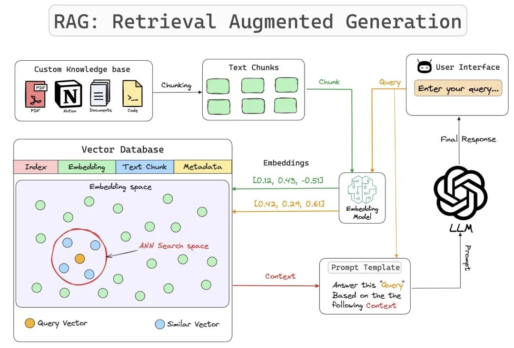
:::
::::::::::::::

::: notes
阶段三：RAG (检索增强生成) —— 给先知发一张图书馆通行证
遇到了什么坑？咒语念得再好，也解决不了企业级信息的滞后。
怎么解决的？这就是前几章说的 RAG。将飞行手册构建为向量数据库。AI 直接检索后照规定作答。这彻底终结了伪造问题。

阶段四：Skills (技能调用) —— 给大脑装上手和脚
遇到了什么坑？RAG 让 AI 有阅读能力，但它无法碰触并修改内部数据库。
怎么解决的？此时行业内引入了 Skills (Function Calling) 技能挂载系统。将公司内部的“查天气”、“改票价”封装为特定接口，AI 根据语境精准发号令请求我们的系统去执行修改。这一跨越正式意味着其有了干预公司数字资产的“手和脚”。
:::

---

## 阶段五与六：绝对自主与严密审查的拉扯

:::::::::::::: {.columns}
::: {.column width="50%"}
::: {.incremental}
- **阶段五：尝试高度自治 (AutoGPT)**
  - 陷入自我观测与死循环风险
  - 脆弱容错性带来严重业务隐患
- **阶段六：工作流切割 (Workflow)**
  - AI 层级拆解：大模型贬为廉价专职节点
  - 人工主导的连线规则
  - 用灵活性换取工业控制级的高安全
:::
:::
::: {.column width="50%"}
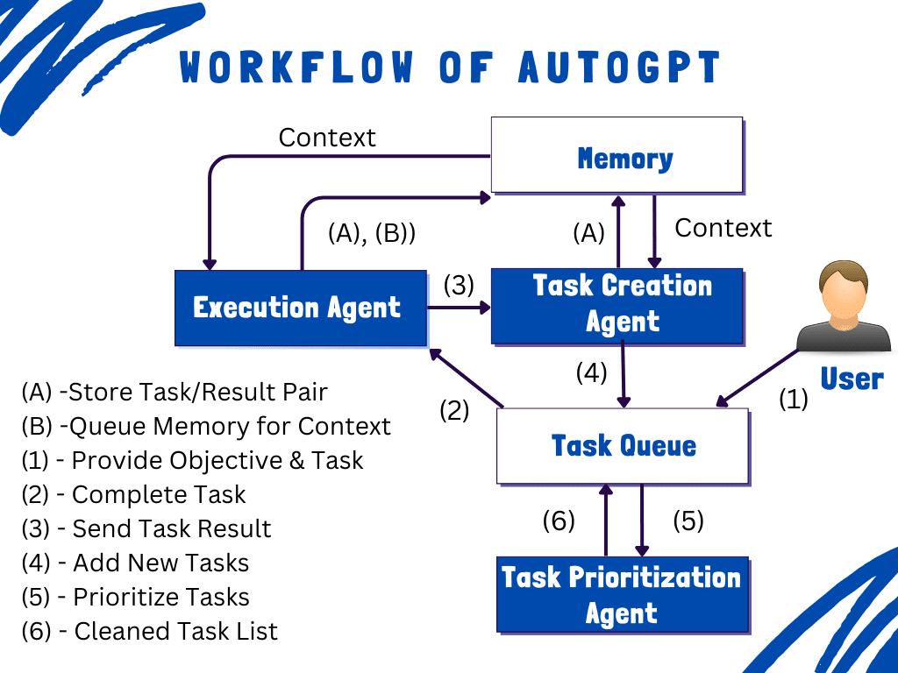
:::
::::::::::::::

::: notes
阶段五：AutoGPT 与失控的自动驾驶
那我们能否丢给 AI 一个极大任务让其自己循环？于是产生了 AutoGPT。它能：思考-行动-观测-再思考，但这导致了无序高危的局面。复杂的系统循环极易陷入微小的局部报错，完全自治的手段被验证是不稳定且危险的。

阶段六：Workflow (工作流) —— 严丝合缝的工厂流水线
航空公司无法容忍失控操作影响业务底线。工业界因此通过 Workflow 化解了这个问题：
让人工强制用连线节点分割流程：节点1读取邮件、节点2调用查询、节点3输出结果。在这种流水线里，只将 AI 安排于单一功能的死板处理中。失去灵活控制权，但博取到了极致的稳定安全红利。
:::

---

## 阶段七：MCP - 真正数字员工的核心接口 

:::::::::::::: {.columns}
::: {.column width="50%"}
::: {.incremental}
- 局限期：信息孤岛开发成本高昂
- **MCP 颠覆 (模型上下文协议)**：
  - AI 生态的“通用 USB-C 接口”
  - 快速即插即用的外部本地与网络权限
  - 由指令响应跨域为“替你上班”的数字实体
:::
:::
::: {.column width="50%"}

:::
::::::::::::::

::: notes
但 Workflow 的致命缺点是泛化能力不足。流程外任务往往无法执行。我们难以对每一次临时性任务都进行繁琐的预定义。
不。到了 2026 年，得益于一项革命性协议的普及，我们终于实现了大家梦寐以求的“真正的数字实体员工”。

阶段七：MCP 与 真正的数字实体员工 (Autonomous Agent)。如果想为其扩展工具与接口，这往往需要高昂的定制化开发成本。
基于 MCP 这个高度标准化的“大接口”打底，我们迎来了**真正完全自治的 Agent（数字员工）**：
回顾一下我在今天刚开场时给大家演示的那一幕：两分钟写完一个游戏. 我并非在简单的对话框中与其交流，而是**为其提供具备运行环境的算力节点，赋予其编写、保存并运行代码的接口权限（MCP）**。
在实际工作中也是一样，你可以对它说：“去帮我抓取各大航空公司的最新油价，比对历史走势，遇到报错自己去查日志、修 Bug，完成后汇总并发送邮件。”然后你可以专注于更高价值的决策工作。
在这个阶段，AI 的形态发生了质变：它进化为一个**类似于真实程序员、真实数字员工的实体**。它在后台默默地**自主执行任务**。它不再是被动等待指令的工具，而是一个真正具备解决问题能力的职场骨干。
:::

---

## Demo 10：MCP Q&A 让 AI 写一段代码并自己运行

::: {style="text-align: center; margin-top: 20%;"}
**系统应用**：利用系统终端实时执行算法运算操作
:::

::: notes
【演示说明】
此时现场演示使用前端大模型环境调用代码能力。
输入：“帮我写一段 Python 代码，计算一下斐波那契数列的前 30 项，并把结果输出。”
:::

---

## Demo 11：MCP Agent 的极限测试（两分钟写完一个737常识考试题库）

::: {style="text-align: center; margin-top: 20%;"}
**系统应用**：验证 MCP 的完整读写执行工程业务全流程
:::

::: notes
【演示说明】
我们将继续做系统级别开发的演示，这能看到完全体的人机协作形态。
输入：“帮我写一个 Next.js 的考试系统，题库内容是 737 飞机的常识考试，要求每道题有四个选项和一个正确答案，并能够在网页进行对飞行员能力的基本考试。”
稍后大家看到完整的在线题库服务部署结果。
:::

---

## 阶段八：A2A 网络 (Agent To Agent)

:::::::::::::: {.columns}
::: {.column width="50%"}
::: {.incremental}
- 从个体走向：网络协同
- 前端分兵：各持专网（如航材代理与气象代理）
- 主控节点：总责拆解与分发
- 通信机制：以自然语言实现多节点自主谈判与纠偏
- 总结：从单纯部署工具，跨越至深度嵌入业务网
:::
:::
::: {.column width="50%"}

:::
::::::::::::::

::: notes
当你的公司里拥有了上百个这种能够独当一面、拥有真实能力的“数字员工 Agent”后，面对庞大的跨部门任务，单兵作战就不够用了。最末端的终极形态随之降临：

真正的职场化网络与 A2A (智能体间协作)
我们设立一个“航材专家 Agent”（插上 MCP 查库存）、一个“气象 Agent”、一个“机组 Agent”。再分配一个主大脑 Agent。
收到指令后主控拆分节点任务。期间，子系统之间利用自然语言交叉确认沟通完成全流程操作。
这不仅是技术的演化，更是人类对 AI 信任度的演化。

今天真正的优势企业，不应仅局限于部署对聊模块，而是开始通过通用能力搭建这些多层级数字人集群协作管线，这也是极长工程验证里沉淀得到的稳健之法。
:::

---

# 第十章：为何当前AI难预测极度复杂金融

## 不具备泛金融决断力的本源

:::::::::::::: {.columns}
::: {.column width="50%"}
::: {.incremental}
- 前提：摒除网络幸存者偏差带来的高收益迷思
- 对比工业量化手段：
  - 微毫厘计算：依靠高频极速传输捕捉瞬时差价
  - 服务器极度毗邻交易所
- 混沌系统难点：
  - 股市交汇数亿规模复杂情感因素
  - 并非基础语言规律模型所能模拟
:::
:::
::: {.column width="50%"}
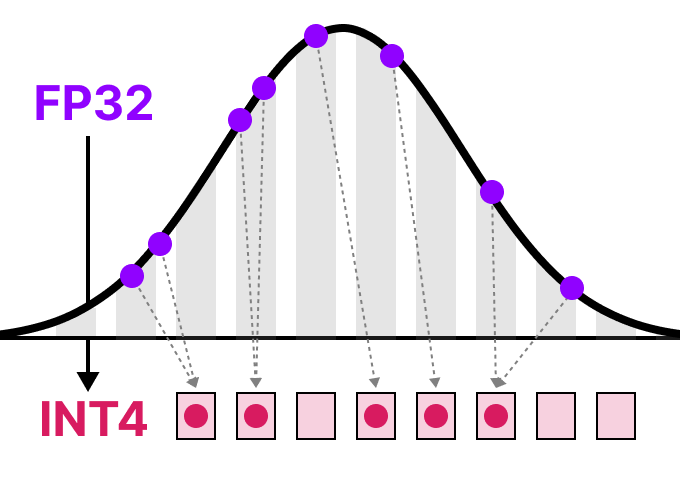
:::
::::::::::::::

::: notes
在上一章，我们见证了 AI 从陪聊进化为能跨部门协作的数字引擎。但我们回顾在首章提及的应用盲区：例如期望利用 AI 代理复杂的金融理财。

面对混沌的金融市场时，完全依赖基础系统架构进行风险标的预测操作，将导致严重的资产损失。网络上部分通过 AI 获取收益的案例，本质是不具备数据支撑的幸存者偏差，而非底层的分析能力使然。

那么，真正在复杂金融领域落地的量化 AI 引擎应具备何种特征？
世界上顶级的投资机构依赖大规模算力集群和高维极速数据运算，以物理托管毗邻的低延迟捕捉市场瞬时差价。
而金融市场是一个包含了数亿人情绪、资金博弈以及全球地缘政治的超级混沌系统。这远非基于文字概率接龙的大语言模型所能预测的系统。这种基础 Agent 面对极度不确定的市场反应，往往表现为情绪化的“过度反应”。
:::

---

## 建立正确的企业 AI 预期

:::::::::::::: {.columns}
::: {.column width="50%"}
::: {.incremental}
- 远离误区：无力判断全局商业周期性与反向定力
- 理清界线：AI 的本质是“完美的效能机器”
- 业务适搭点：
  - 规则性文档与逻辑确认任务
  - 海量资料合并
- 高管抉择：维持全局商业宏观的自主判断率
:::
:::
::: {.column width="50%"}

:::
::::::::::::::

::: notes
毫无战略定力的底层算法逻辑，本质上与投资所需的克制、分散以及反周期的商业原则相背道而驰。这正是为何我们需要明确 AI 能力边界的原因。

AI 是一台完美的“效能机器”。它极其擅长梳理复杂日志并执行逻辑运算。它并非全知的精准预言机。它可以协助撰写详尽的运作分析报告，但无法替代您在重大并购或风险评估中的战略决策。

让 AI 承担繁重的执行任务；由管理者维持宏观的自主判断力。明确了应用边界后，让我们放眼更宏大的全球商业版图。
:::

---

# 第十一章：2026 巨头商业阳谋与破局

## 算力能源化：不可替代的重工业化

:::::::::::::: {.columns}
::: {.column width="50%"}
::: {.incremental}
- 表象破除：研发 AI 绝非单纯轻研发体系架构
- 能耗困境：对数据电力支撑体系极其贪婪
- 企业落子避坑：
  - 摒弃虚耗巨资复刻大底座
  - 扮演高位技术红利的吸纳者
:::
:::
::: {.column width="50%"}
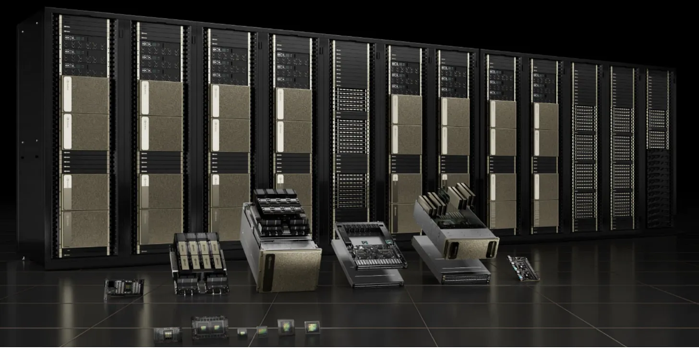
:::
::::::::::::::

::: notes
在这场被称为“新工业革命”的浪潮里，过去三年，全球涌入了超过 1700 亿美元的资本投入。这笔投资深刻改变了技术格局。在这个由算法和算力构筑的新世界里，全球最顶级的科技巨头们，正在打一场怎样的超级战争？我们作为实体产业，又该如何在他们的博弈中寻找红利？

我为大家提炼了当前全球 AI 棋局的三个核心真相。

真相一：AI 已经不再是软件，而是“重工业”。
2026 年初，美国白宫紧急召集了微软、谷歌、亚马逊、Meta 的负责人开了一场闭门会议。会议的核心议题不是虚幻的机器觉醒，而是一个严峻的客观事实：**能源供应面临极大挑战。** 随着模型参数的爆炸式增长，超大规模 GPU 计算集群对电力的消耗达到了前所未有的量级，甚至开始挤占民用电网的峰值负载。美国政府甚至要求这些巨头必须自主建设发电厂、布局核能储备，才能继续扩建数据中心。这释放了一个明确的信号：**AI 的底层逻辑已经演变为极度依赖电力、冷却系统和芯片供应链的“重型基础设施产业”。**

对航空公司的启示：自主构建底层基础大模型通常不符合实体企业的投资回报率。这是一场资金与资源密集的持久战。我们的战略应当是做最聪明的**“技术应用者”**——让硅谷和深圳的巨头们去承担高昂的能源与模型训练成本，我们专注于利用其成熟模型来优化自身的业务逻辑。
:::

---

## 11.2.1 微软与亚马逊：基础设施的赋能者

:::::::::::::: {.columns}
::: {.column width="50%"}
::: {.incremental}
- **微软与 OpenAI 深度绑定**
- **目标：AI 时代的“水电煤”**
- **AWS：极致压缩成本与物流效率**
- **提供高度灵活的云底座**
:::
:::
::: {.column width="50%"}
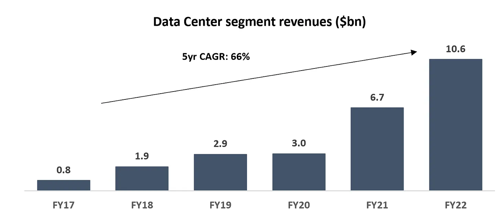
:::
::::::::::::::

::: notes
#### 11.2.1 微软与亚马逊：基础设施的赋能者

微软投入巨资深度绑定 OpenAI，其野心是实现 AI 对操作系统与办公软件的全方位渗透。它致力于成为 AI 时代的“水电煤”。而亚马逊（AWS）则利用强大的 AI 算法，极致压缩了其庞大物流网络的仓储与航机调度成本；对外，它提供高度灵活的云底座，通过多元化的算力支持来吸引全球企业。
:::

---

## 11.2.2 Meta 的生态策略：打破垄断的开源力量

:::::::::::::: {.columns}
::: {.column width="50%"}
::: {.incremental}
- **Llama：全球开源模型先锋**
- **击穿大模型的算力溢价壁垒**
- **普惠化、低门槛的基础设施**
- **反哺核心社交与流量生态**
:::
:::
::: {.column width="50%"}

:::
::::::::::::::

::: notes
#### 11.2.2 Meta 的生态策略：打破垄断的开源力量

Meta 采取了截然不同的路径。它投入巨资研发 Llama 大模型，并面向全球开源。这一战略意图非常明确：既然在公有云领域难以与微软、谷歌正面抗衡，那就将“大模型”彻底转化为低门槛、普惠化的基础设施。通过摧毁竞争对手的技术溢价，Meta 能够更有效地反哺其核心的社交广告与流量生态。
:::

---

## 11.2.3 苹果的差异化：隐私与终端计算

:::::::::::::: {.columns}
::: {.column width="50%"}
::: {.incremental}
- **端侧计算优先战略**
- **首创“私有云计算”架构**
- **保护航司高度敏感数据**
- **构建高净值客户的信任护城河**
:::
:::
::: {.column width="50%"}

:::
::::::::::::::

::: notes
#### 11.2.3 苹果的差异化：隐私与终端计算

当全行业都在采集用户数据训练模型时，苹果坚持端侧计算优先，并首创了“私有云计算”。航空公司掌握着旅客敏感的身份、行程与支付数据。苹果的示范效应告诉我们：AI 应用不一定依赖公有云。在未来，能够深度理解用户且确保隐私安全的系统，才能赢得最高净值客户的信任。
:::

---

## 11.3 真相三：效率驱动的“成本革命”

:::::::::::::: {.columns}
::: {.column width="50%"}
::: {.incremental}
- **非对称战争**：不拼规模，拼效率与架构创新
- **通义千问 (Qwen)**：全面开源、双思维模式、全球化普惠
- **DeepSeek**：算法级突破、极致压缩训练成本
- **准入门槛大幅降低**：高智商 AI 服务变得极其普及且廉价
:::
:::
::: {.column width="50%"}
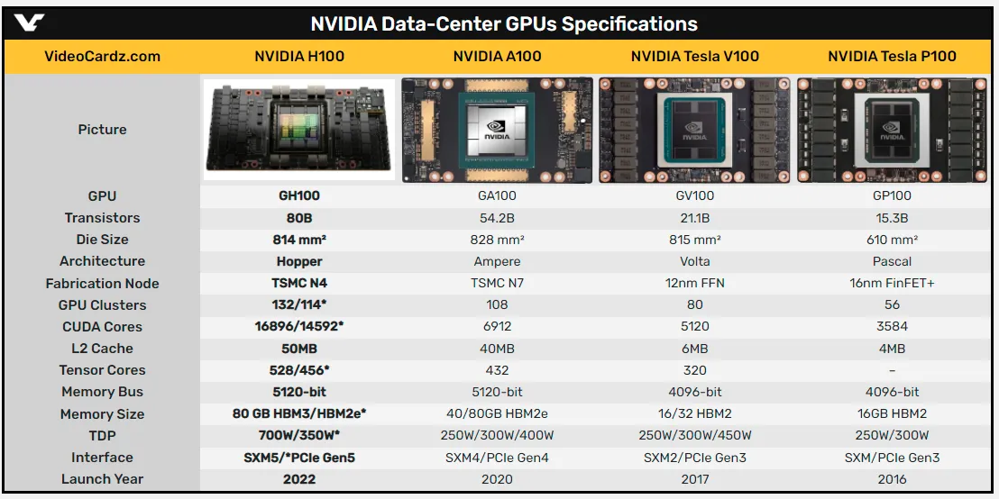
:::
::::::::::::::

::: notes
真相三：效率驱动的“成本革命”
如果说北美巨头在进行算力与能源的规模战，那么中国科技企业则打出了一场“非对称战争”——**不拼规模，拼效率。** 中国企业致力于将顶级 AI 的使用成本降至极低。这里有两个典型案例：

一个是阿里巴巴（通义千问 Qwen）。它不仅全面开源，而且独创了“双思维模式”，极具普惠性且支持全球多语言。它让全球企业意识到：中国开源模型同样能高效处理复杂业务，且无需承担高昂的 Token 费用。

另一个是实现算法突破的 DeepSeek。DeepSeek 团队通过数学架构的创新，证明了“效率优于规模”。其旗舰模型在处理复杂推理任务时，实力足以匹敌顶尖闭源模型，但训练成本大幅降低。DeepSeek 将强大的 AI 智力以极低的价格向全球释放，大幅降低了 AI 的准入门槛。这向企业传递了一个明确利好：**高智商的 AI 服务已变得极其普及且廉价。**
:::

---

---

## 11.4 真相四：脆弱的用户黏性与“代际倒戈”的风险

:::::::::::::: {.columns}
::: {.column width="50%"}
::: {.incremental}
- **品牌忠诚度匮乏**：用户高度依赖智力基准，而非平台惯性
- **测评榜单导向**：能力超越即引发千万级用户的瞬时流失
- **行业颠覆加速**：不再需要长周期积累，AI 交互重塑核心门槛
- **先发制人**：抢先利用 AI 武装业务线，应对随时而至的竞争
:::
:::
::: {.column width="50%"}

:::
::::::::::::::

::: notes

真相四：脆弱的用户黏性与“代际倒戈”的风险

当我们审视巨头间的算力竞赛时，必须注意到一个前所未有的现象——**脆弱的用户黏性（User Stickiness）**。

过去，常旅客系统或生态闭环能产生极高的迁移成本。但在 AI 时代，用户表现出**高度依赖智力基准**的特征。一旦竞争对手的模型在逻辑推理或响应质量上实现超越，千万级用户可能在短时间内完成平台转投。

这种低黏性不仅困扰着巨头，也给传统行业敲响了警钟。既然强大的 AI 能力已变得唾手可得，行业颠覆不再需要长周期的积累。一旦新的竞争对手整合了更智能的 AI 交互体验（例如一个能实时感知旅客情绪并秒级规划中转方案的数字管家），原本忠诚于你们的高净值用户可能会迅速流失。因此，抢先利用 AI 武装业务线，已成为实体产业维护竞争门槛的当务之急。

:::

---

## 11.5 终局：从“工具操控”到“数字员工管理”

:::::::::::::: {.columns}

::: {.column width="50%"}

::: {.incremental}

- **智能代理时代**：AI 从被动工具进化为主动代理 (Agentic AI)

- **任务委派模式**：不再关注“怎么做”，而是关注“做什么”

- **全流程自主**：Agent 自主执行查库、分析、修复与汇总

- **生产力质变**：协作模式从“操控工具”升级为“管理员工”

:::

:::

::: {.column width="50%"}

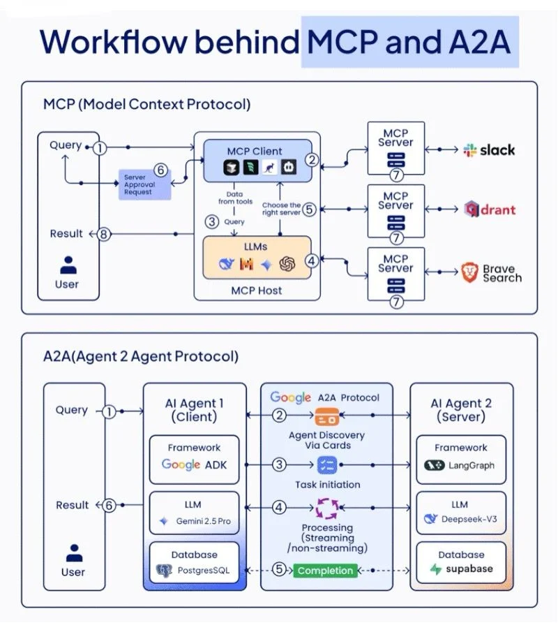

:::

::::::::::::::

::: notes

终局：从“工具操控”到“数字员工管理”

综上所述，2026 年最深刻的生产力质变在于：我们正式进入了**“智能代理时代（Agentic Era）”**。

以前，你需要极其细致地“指导”AI 怎么做；现在，工作流变成了“异步（Asynchronous）”的。您可以像对下属布置任务一样，对 AI 说：“去帮我排查一下今天所有延误航班的共性原因，比对天气数据，写一份报告发给运行总监。”

然后，您可以专注于更高价值的决策工作。这个 AI 代理会**自己**去查数据库，**自己**去网络上抓取气象记录，**自己**分析逻辑，遇到报错**自己**修复，直到把任务完成。

**人类与机器的协作模式，已从“操控一件工具”，进化为“管理一个员工”。**

:::

---

---

## 11.6 结语：航空业的终极护城河

:::::::::::::: {.columns}
::: {.column width="50%"}
::: {.incremental}
- **核心资产**：沉淀数十年的海量飞行数据、维修记录与旅客画像
- **战略石油**：高质量的专有行业数据是企业的核心竞争力
- **向量化转型**：将离线数据转化为高维空间的智能路网
- **把握红利**：在技术洪流中精准捕捉痛点，开启智能航空新篇章
:::
:::
::: {.column width="50%"}
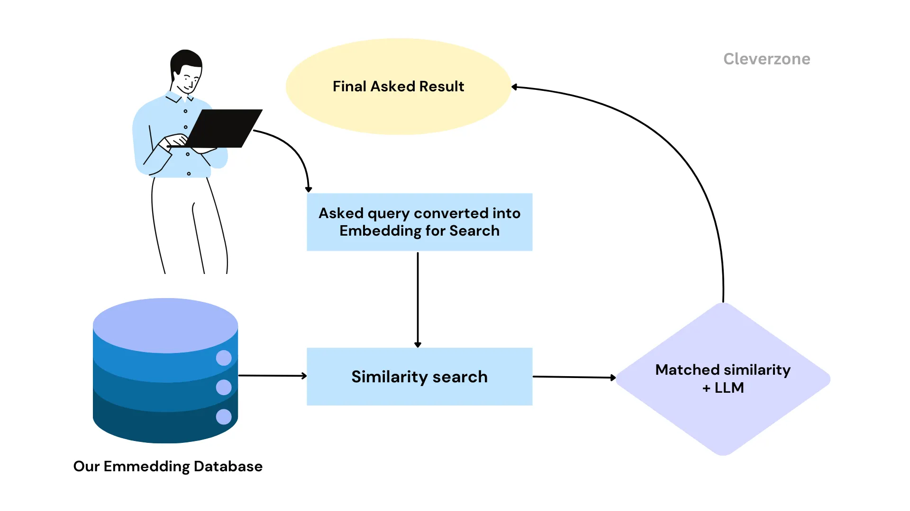
:::
::::::::::::::

::: notes
各位航空公司的高管，今天我们共同审视了 AI 的技术本质与商业版图。

在这个最好的时代，我们航空公司的核心资产并非算力设备，而是**独有的、沉淀了数十年的海量飞行 QAR 数据、维修记录以及旅客行为画像。**

这些高质量的行业数据，才是真正的战略石油。

谁能最先理解并应用“向量化”技术，将沉淀的离线数据转化为高维空间的智能路网；谁能率先利用高性价比模型打造出“自主代理 Agent”……谁就能在下一场效率革命中锁定胜局。

希望今天的分享能为各位带来启发，让我们在技术洪流中精准捕捉业务痛点，共同开启智能航空的新篇章。
:::

